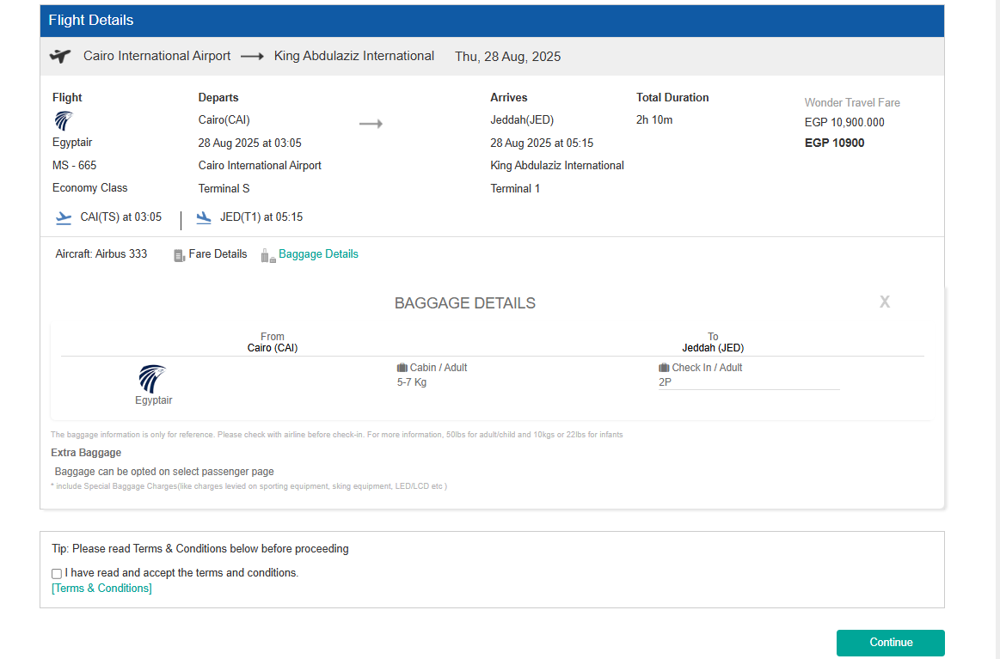
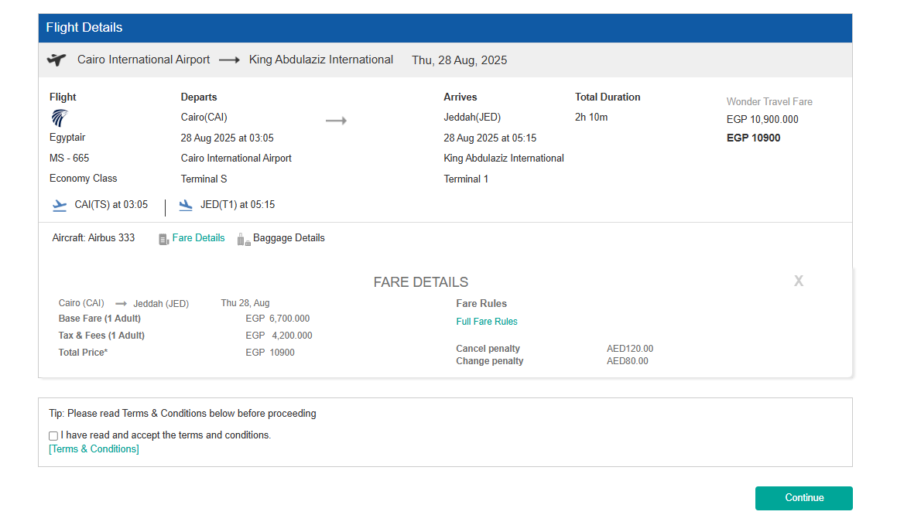

## ✈️ Booking Module Investigation – Flight Review Page Contract Review

Welcome aboard! This document captures the ongoing work and analysis related to the **Flight Review Page** of our Booking Module. The goal? To modernize, simplify, and document the backend/frontend contracts with elegance and clarity.

---

### 🎯 Objective

Break down the legacy structure of `requestBean`and `flightOption` on the Flight Review Page → Compare it to modern, RESTful, Angular-friendly alternatives → Recommend transformations that make the codebase cleaner, leaner, and future-proof.

---

## 🛬 Page: Flight Review Page

#### mainly this page Preview all information of the flight including Fare Details and Baggage Details

### 🧩 Object: `requestBean`

The `requestBean` object is central to the **Flight Review Page**, carrying key search inputs from the user. It supports three scenarios:

- 🛫 One Way
- 🔄 Round Trip
- 🌍 Multi-City

As part of the modernization effort, we compare the old legacy structure against a simplified, REST-compliant version.

---

### 📅 Legacy `requestBean` Structure

- **Format:** Verbose object with many unused fields and nulls
- **Trip Support:** One Way, Round Trip, Multi-City
- **Delivery:** Injected in `ModelAndView` and used in JSP rendering
<details>
<summary> <h4 style="display: inline-block"> 🧾 Sample old  <code>RequestBean</code> Value: 111 proprties</h4> </summary>

```json
{
  "dataFromCacheOrNot": true,
  "searchId": 0,
  "prefferedAirline": null,
  "baggageFareOnly": false,
  "multiAvailability": false,
  "flexibleDateForCaching": false,
  "isDateFlexible": false,
  "isNonStop": false,
  "hotelCrossSell": false,
  "noOfAdults": "1",
  "noOfChilds": "1",
  "lastFiveSearch": false,
  "corporateIdList": [],
  "passengerType": "true",
  "hotelRequestBean": null,
  "upgradeBooking": 0,
  "fareMismatch": 0,
  "selectedHotel": null,
  "flightwidgetElement": [
    {
      "startingFrom": "CAI",
      "goingTo": "JED",
      "startingFromName": "Cairo International Airport",
      "goingToName": "King Abdulaziz International",
      "startingFromCity": "Cairo",
      "goingToCity": "Jeddah",
      "dateOfJourney": "17-09-2025",
      "cabinClass": "1",
      "destCountryId": 195,
      "originCountryId": 67
    },
    {
      "startingFrom": "JED",
      "goingTo": "CAI",
      "startingFromName": "King Abdulaziz International",
      "goingToName": "Cairo International Airport",
      "startingFromCity": "Jeddah",
      "goingToCity": "Cairo",
      "dateOfJourney": "20-09-2025",
      "cabinClass": "1",
      "destCountryId": 67,
      "originCountryId": 195
    },
    {
      "startingFrom": "CAI",
      "goingTo": "SHJ",
      "startingFromName": "Cairo International Airport",
      "goingToName": "Sharjah",
      "startingFromCity": "Cairo",
      "goingToCity": "Sharjah",
      "dateOfJourney": "24-09-2025",
      "cabinClass": "1",
      "destCountryId": 2,
      "originCountryId": 67
    }
  ],
  "prefferedAirlineName": null,
  "isExcludeLcc": false,
  "bookingViaSearch": null,
  "nearByAirport": false,
  "noOfInfants": "1",
  "tripType": "MultiCity",
  "allianceName": null,
  "orderId": null,
  "returnAllFaresResultFromGal": false,
  "passengerIdList": [],
  "seeMore": false
}
```

</details>

---

### 🏷️ Legacy Endpoint Reference

- **Endpoint URL:**  
  `odeysysadmin/flight/flightReview`
- **Request Method:**  
  `POST`
- **Payload Parameters:**
  - `requestBean`
  - `onwardFlightOptionJson`
  - `fareResponse`
  - `fromSaveQuote`
  - `quotationId`
  - `productSequence`

This legacy endpoint handled the flight review page using a POST request with multiple complex payload objects.

---

### ✅ Recommended REST API `requestBean` Structure

- **API Endpoint:** `GET /flight/request/${flightId}or{bookingRef}or${orderId}`
- **Usage:** Frontend-driven, Angular compatible, form-based
- **Design Goals:** Simplicity, relevance, clarity
- only 14 proprties

```json
{
  "requestBean": {
    "tripType": "string",
    "noOfAdults": "string",
    "noOfChilds": "string",
    "noOfInfants": "string",
    "flightwidgetElement": [
      {
        "startingFromAirportName": "string",
        "startingFromCityName": "string",
        "startingFromCityCode": "string",
        "goingToAirportName": "string",
        "goingToCityName": "string",
        "goingToCityCode": "string",
        "dateOfJourney": "string"
      }
    ]
  }
}
```

---

### 🧠 Observations

- Old object includes multiple nulls, nested unused lists, and internal logic variables
- Recommended structure includes **only user-facing, required fields**
- Easier to validate, test, and debug in frontend/backend interaction
- Designed to support all trip types with a normalized structure

---

## 🧩 Object: `flightOption`

### 📅 Legacy `flightOption` Structure

- **Format:** Verbose object with many unused fields and nulls
- **Trip Support:** One Way, Round Trip, Multi-City
- **Delivery:** Injected in `ModelAndView` and used in JSP rendering

## 🛫 One Way

<details>
<summary> <h4 style="display: inline-block"> 🧾 Sample old  <code>flightOption</code> (one way) Value : 496 proprties</h4> </summary>

```json
{
  "destination": "JED",
  "origin": "CAI",
  "lccflight": false,
  "amadeusFlightOptionDetails": null,
  "onwardJourneyDateFormat": null,
  "laggage": null,
  "fullLaggage": false,
  "fareBasisCodes": null,
  "flightFare": {
    "currency": "EGP",
    "markup": false,
    "baggageOptionsList": null,
    "actualTotalBaseFare": 220,
    "totalBaseFare": 2200,
    "actualTotalFare": 1040,
    "actualTotalTaxFare": 820,
    "totalTax": 8200,
    "totalFees": 0,
    "markupPrice": 0,
    "discountPrice": 0,
    "serviceChargePrice": 600,
    "markdown": false,
    "remark": null,
    "adultDiscountPrice": 0,
    "adultMarkupPrice": 0,
    "adultServiceChargePrice": 200,
    "childDiscountPrice": 0,
    "childMarkupPrice": 0,
    "childServiceChargePrice": 200,
    "infantDiscountPrice": 0,
    "infantMarkupPrice": 0,
    "infantServiceChargePrice": 200,
    "fareType": "Published Fare",
    "branchMarkup": 0,
    "rph": null,
    "fareSellKey": "qe0xrf0CuDKAtbL3guAAAA==",
    "totalNet": 10400,
    "corporateDealCode": null,
    "bookingPcc": null,
    "agentMarkup": 0,
    "adultBaseFare": 1100,
    "adultTax": 3200,
    "childBaseFare": 900,
    "childTax": 3202,
    "infantBaseFare": 200,
    "infantTax": 1800,
    "adultFees": 0,
    "childFees": 0,
    "infantFees": 0,
    "offerItemID": null,
    "childTourCode": null,
    "offerID": null,
    "adultFareId": null,
    "childFareId": null,
    "infantFareId": null,
    "adultFareInfoRef": [
      {
        "airSegmentRef": "qe0xrf0CuDKArbL3guAAAA==",
        "fareInfoRef": "qe0xrf0CuDKA8bL3guAAAA==",
        "fareRuleKey": "6UUVoSldxwhiV+mul58U38bKj3F8T9EyxsqPcXxP0TLGyo9xfE/RMsuWFfXVd1OAly5qxZ3qLwOXLmrFneovA5cuasWd6i8Dly5qxZ3qLwOXLmrFneovA+9AUf3xBI7zxWa1uaqI55k3aSkvhp2ybVqO5aAZ5IhGwSqtYEI9rFVN3J3NyYpz6Wd/HthdcUD2yst5h5wAlv6xbVxvEq8pY2LgFn3B9sPdSU8gecfbWEnMU535bvD9TB5ilQoX7RIZzukd+fDqEGh3YT9dyBPONkPFc7ZmQhP+mpBH9wehGMEn6V7c0rHrrUUnJYPBFNfb/AFKEXb03hK/he9va7VDH7+F729rtUMfv4Xvb2u1Qx+/he9va7VDHxDGJun84l6GmjYuszn207WOnxkQ2WPPHvaVUAnec78/qc2V/LDU7azsIhAEP8Hr99wXtO9a1rEPVV9ISKSaAaI="
      }
    ],
    "childFareInfoRef": [
      {
        "airSegmentRef": "qe0xrf0CuDKArbL3guAAAA==",
        "fareInfoRef": "qe0xrf0CuDKAscL3guAAAA==",
        "fareRuleKey": "6UUVoSldxwhiV+mul58U38bKj3F8T9EyxsqPcXxP0TLGyo9xfE/RMsuWFfXVd1OAly5qxZ3qLwOXLmrFneovA5cuasWd6i8Dly5qxZ3qLwOXLmrFneovA+9AUf3xBI7zxWa1uaqI55k3aSkvhp2ybVqO5aAZ5IhGAkur1RStnexN3J3NyYpz6Wd/HthdcUD2yst5h5wAlv6xbVxvEq8pY2LgFn3B9sPdSU8gecfbWEnsEf34vHSKSh5ilQoX7RIZzukd+fDqEGh3YT9dyBPONkPFc7ZmQhP+mpBH9wehGMEn6V7c0rHrraEI7u9D6R8s/AFKEXb03hK/he9va7VDH7+F729rtUMfv4Xvb2u1Qx+/he9va7VDHxDGJun84l6GmjYuszn207WOnxkQ2WPPHvaVUAnec78/mdHfDeq1iSvsIhAEP8Hr99wXtO9a1rEPVV9ISKSaAaI="
      }
    ],
    "infantFareInfoRef": [
      {
        "airSegmentRef": "qe0xrf0CuDKArbL3guAAAA==",
        "fareInfoRef": "qe0xrf0CuDKAadL3guAAAA==",
        "fareRuleKey": "6UUVoSldxwhiV+mul58U38bKj3F8T9EyxsqPcXxP0TLGyo9xfE/RMsuWFfXVd1OAly5qxZ3qLwOXLmrFneovA5cuasWd6i8Dly5qxZ3qLwOXLmrFneovA+9AUf3xBI7zxWa1uaqI55k3aSkvhp2ybVqO5aAZ5IhGPdBlOEEnVhbnWmtUsVS8URfpwdtAga01qdxn/S4oEcJfefO/N51YYYX+hNfHEXoxUV3b2b+cmv9JBCYAkTJzwD/9+1PBdevmunfTOBv+12m392E/mQQXuoMN1QPqv5Kjd7qrB3nitl7cOOIUvvfH3rQoIPG/L5vry5YV9dV3U4CXLmrFneovA5cuasWd6i8Dly5qxZ3qLwOXLmrFneovAzzD4Wdjal2fHna1H5QsLdGaNi6zOfbTtY770mJHGJ8MQvdafCnE/eYs/QMtR32b03PekyWRs464bEHvHyI5ZlQ="
      }
    ],
    "galileoHostTokenList": null,
    "airPricingSolution": null,
    "airPricingInfoMapCHD": null,
    "airPricingInfoMapINFT": null,
    "paxRefID": null,
    "paxJourneyRefID": null,
    "totalSurchargeAmout": 0,
    "flightSurchargeBreakUps": null,
    "fareBasisCode": null,
    "agencyMarkup": 0,
    "serviceTax": 0,
    "manualDealCode": null,
    "actualSsrMealAmt": 0,
    "actualSsrBaggageAmt": 0,
    "actualSsrSeatAmt": 0,
    "odeysysPrice": 11000,
    "paxAdtTaxBreakup": [
      {
        "taxCode": "EG",
        "taxAmount": 200,
        "actualTaxAmount": 0,
        "taxDesc": ""
      },
      {
        "taxCode": "EQ",
        "taxAmount": 100,
        "actualTaxAmount": 0,
        "taxDesc": ""
      },
      {
        "taxCode": "JK",
        "taxAmount": 100,
        "actualTaxAmount": 0,
        "taxDesc": ""
      },
      {
        "taxCode": "O2",
        "taxAmount": 100,
        "actualTaxAmount": 0,
        "taxDesc": ""
      },
      {
        "taxCode": "O9",
        "taxAmount": 100,
        "actualTaxAmount": 0,
        "taxDesc": ""
      },
      {
        "taxCode": "QH",
        "taxAmount": 1000,
        "actualTaxAmount": 0,
        "taxDesc": ""
      },
      {
        "taxCode": "S4",
        "taxAmount": 100,
        "actualTaxAmount": 0,
        "taxDesc": ""
      },
      {
        "taxCode": "XK",
        "taxAmount": 200,
        "actualTaxAmount": 0,
        "taxDesc": ""
      },
      {
        "taxCode": "E3",
        "taxAmount": 100,
        "actualTaxAmount": 0,
        "taxDesc": ""
      },
      {
        "taxCode": "YR",
        "taxAmount": 1200,
        "actualTaxAmount": 0,
        "taxDesc": ""
      }
    ],
    "paxChdTaxBreakup": [
      {
        "taxCode": "EG",
        "taxAmount": 200,
        "actualTaxAmount": 0,
        "taxDesc": ""
      },
      {
        "taxCode": "EQ",
        "taxAmount": 100,
        "actualTaxAmount": 0,
        "taxDesc": ""
      },
      {
        "taxCode": "JK",
        "taxAmount": 100,
        "actualTaxAmount": 0,
        "taxDesc": ""
      },
      {
        "taxCode": "O2",
        "taxAmount": 100,
        "actualTaxAmount": 0,
        "taxDesc": ""
      },
      {
        "taxCode": "O9",
        "taxAmount": 100,
        "actualTaxAmount": 0,
        "taxDesc": ""
      },
      {
        "taxCode": "QH",
        "taxAmount": 1000,
        "actualTaxAmount": 0,
        "taxDesc": ""
      },
      {
        "taxCode": "S4",
        "taxAmount": 100,
        "actualTaxAmount": 0,
        "taxDesc": ""
      },
      {
        "taxCode": "XK",
        "taxAmount": 200,
        "actualTaxAmount": 0,
        "taxDesc": ""
      },
      {
        "taxCode": "E3",
        "taxAmount": 100,
        "actualTaxAmount": 0,
        "taxDesc": ""
      },
      {
        "taxCode": "YR",
        "taxAmount": 1200,
        "actualTaxAmount": 0,
        "taxDesc": ""
      }
    ],
    "paxInfTaxBreakup": [
      {
        "taxCode": "EG",
        "taxAmount": 200,
        "actualTaxAmount": 0,
        "taxDesc": ""
      },
      {
        "taxCode": "EQ",
        "taxAmount": 100,
        "actualTaxAmount": 0,
        "taxDesc": ""
      },
      {
        "taxCode": "JK",
        "taxAmount": 100,
        "actualTaxAmount": 0,
        "taxDesc": ""
      },
      {
        "taxCode": "O2",
        "taxAmount": 100,
        "actualTaxAmount": 0,
        "taxDesc": ""
      },
      {
        "taxCode": "O9",
        "taxAmount": 100,
        "actualTaxAmount": 0,
        "taxDesc": ""
      },
      {
        "taxCode": "QH",
        "taxAmount": 1000,
        "actualTaxAmount": 0,
        "taxDesc": ""
      },
      {
        "taxCode": "XK",
        "taxAmount": 100,
        "actualTaxAmount": 0,
        "taxDesc": ""
      },
      {
        "taxCode": "E3",
        "taxAmount": 100,
        "actualTaxAmount": 0,
        "taxDesc": ""
      }
    ],
    "fareTypeCode": "Published Fare",
    "cabinClass": "Economy",
    "actualTotalChildBaseFare": 0,
    "actualTotalChildTax": 0,
    "actualTotalChildFee": 0,
    "actualTotalInfantBaseFare": 0,
    "actualTotalInfantTax": 0,
    "actualTotalInfantFee": 0,
    "travelFusionFeeDescription": null,
    "travelFusionBookingFee": 0,
    "adultFareType": "Published",
    "childFareType": "Published",
    "infantFareType": "Published",
    "fareBrand": "BASIC ECO",
    "fareTypeID": null,
    "totalAgencyCommission": 0,
    "actualTotalAgencyCommission": 0,
    "bundledServiceCharge": 0,
    "actualBundledServiceCharge": 0,
    "childCorporateDealCode": null,
    "infantCorporateDealCode": null,
    "adultAllowedCheckinBaggage": "",
    "adultAllowedHandBaggage": "",
    "childAllowedCheckinBaggage": "",
    "childAllowedHandBaggage": "",
    "infantAllowedCheckinBaggage": "",
    "infantAllowedHandBaggage": "",
    "fareClass": "V",
    "plb": 0,
    "refundableInfo": "WT 1U-REFUNDABLE",
    "serviceFee": 0,
    "tds": 0,
    "transactionFee": 0,
    "paxAdtFeesBreakup": null,
    "paxChdFeesBreakup": null,
    "paxInfFeesBreakup": null,
    "fareNote": null,
    "cancelPanelty": "AED350.00",
    "changePanelty": "AED200.00",
    "baggageIncluded": false,
    "actualTotalFee": 0,
    "airpricingInfoADT": null,
    "adultTourCode": null,
    "displayOnlycabinClass": null,
    "adultActualTotalFare": 0,
    "childActualTotalFare": 0,
    "infantActualTotalFare": 0,
    "adultNegoFare": false,
    "childNegoFare": false,
    "infantNegoFare": false,
    "infantTourCode": null,
    "voluntaryRefundsAdult": null,
    "voluntaryChangesChild": null,
    "voluntaryRefundsChild": null,
    "voluntaryChangesInfant": null,
    "voluntaryRefundsInfant": null,
    "voluntaryChangesAdult": null,
    "actualTravelFusionFee": 0,
    "actualAdultBaseFare": 0,
    "actualAdultTax": 0,
    "actualAdultFees": 0,
    "actualChildBaseFare": 0,
    "actualChildTax": 0,
    "actualchildFees": 0,
    "actualInfantBaseFare": 0,
    "actualInfantTax": 0,
    "actualInfantFees": 0,
    "actualTotalAdultBaseFare": 0,
    "actualTotalAdultTax": 0,
    "actualTotalAdultFee": 0
  },
  "flightOptionKey": "OneWay|GAL|CAI|2025-09-19|SV|386|V|2025-09-19|JED",
  "originCountry": "67",
  "destinationCountry": "195",
  "noOfAdults": 1,
  "noOfChilds": 1,
  "onlyBaggageFareSearch": false,
  "searchPCCId": "287",
  "platingCarrierName": "Saudi Arabian",
  "noOfTotalStops": 0,
  "connecting": false,
  "ndcSearchResponseID": null,
  "serviceVendor": "Galileo",
  "journeySellKey": null,
  "offerId": null,
  "ndcRulesAndPenalties": null,
  "journeyDurationInMinutes": 0,
  "originCountryCode": null,
  "destinationCountryCode": null,
  "multiCarrier": false,
  "destinationCity": "3635",
  "onwardJourneyDate": "2025-09-19",
  "totalJourneyDuration": "135",
  "childCheckinBaggage": "1P",
  "adultCheckinBaggage": "1P",
  "infantCheckinBaggage": "1P",
  "currencyRate": 10,
  "noOfInfants": 1,
  "importPnr": false,
  "totalFare": 10400,
  "flightUUID": null,
  "responseID": null,
  "flyDubaiFlightOptionDetails": null,
  "discountIdAdult": null,
  "discountIdChild": null,
  "discountIdInfant": null,
  "destinationId": null,
  "fareRule": null,
  "airlinePNR": null,
  "promoFare": false,
  "ndcintegration": false,
  "validLaggage": false,
  "cardPreRegister": false,
  "useTFPrepay": false,
  "ssrPrice": 0,
  "fareAvailabilityKey": null,
  "trackingId": "db9d660a-a1b8-404d-87c0-c240fd436254",
  "bookAndHoldAllowedForSupplier": false,
  "baggageAllowedForSupplier": false,
  "brandCodeSabre": [],
  "fareBaseCodeSabre": [],
  "supplierSettings": {
    "iqamaAllowed": false,
    "dynamicCurrencyAllowed": false,
    "ticketVoidAllowed": false,
    "bookAndHoldAllowed": false,
    "gdsSupplier": false,
    "fareConfirmBeforePayAfterHoldAllowed": false,
    "cancelBookAndHoldAllowed": false,
    "bundleAllowed": false,
    "syncPnrAllowed": false,
    "baggageAllowed": false
  },
  "vendorSignature": null,
  "routingId": null,
  "lfId": null,
  "airIndiaExpressFlightOption": null,
  "offerImgPath": null,
  "offerDesc": null,
  "bundledServiceId": null,
  "bundledServiceName": null,
  "includedServies": null,
  "tagFlightDesc": "",
  "gdsOfficeId": "P3429834",
  "noOfConnectingPoints": 0,
  "airMultiAvailabilityResp": false,
  "flightDetKey": "SV386|GAL",
  "tagFlight": null,
  "spiceFlightOptionDetails": null,
  "quantity": 1,
  "moreOptions": null,
  "lccPromoCode": null,
  "adtBagCode": null,
  "chdBagCode": null,
  "originCityCode": "CAI",
  "destinationCityCode": "JED",
  "offerItemID": null,
  "orderItemID": null,
  "carryOnCharges": null,
  "airAirarabiaFlightOptionDetails": null,
  "offerID": null,
  "hazUmarhJed": false,
  "viaFlight": false,
  "orderID": null,
  "agencyCurrencyCode": null,
  "platingCarrier": "SV",
  "flightlegs": [
    {
      "destination": "JED",
      "origin": "CAI",
      "status": null,
      "originName": "Cairo International Airport",
      "flightSwitchingWaitingTime": "",
      "carrier": "SV",
      "originCountry": "67",
      "destinationCountry": "195",
      "depDate": "2025-09-19",
      "originCityName": "Cairo",
      "destinationCityName": "Jeddah",
      "operatedByAirlineName": "Saudi Arabian",
      "technicalStopList": null,
      "rph": null,
      "flightTime": 0,
      "ndcSegmentRef": "",
      "equipmentType": null,
      "supplierArrDate": null,
      "departDateFromResponse": null,
      "arrivalDateFromResponse": null,
      "flightReference": null,
      "shuraDepDate": null,
      "shuraArrDate": null,
      "shuraArrTime": null,
      "flightSwitchingWaitingTimeMin": 0,
      "shuraDeptTime": null,
      "cabinBaggage": null,
      "includedBaggage": null,
      "destinationName": "King Abdulaziz International",
      "originCityCode": "CAI",
      "destinationCityCode": "JED",
      "fareBasisCode": "VAOTEGB4",
      "arrDate": "2025-09-19",
      "arrTime": "04:05:00",
      "operatedByAirline": "SV",
      "depTerminal": "2",
      "depTime": "01:50:00",
      "equipment": "330",
      "flightNumber": "386",
      "journeyDuration": "2h 15m",
      "stopover": "0",
      "operatedByFound": false,
      "arrTerminal": "1",
      "supplierClassDescription": null,
      "travelFusionClass": null,
      "changeOfPlane": "false",
      "eTicketability": null,
      "linkAvailability": "true",
      "optionalServicesIndicator": "false",
      "participantLevel": "Secure Sell",
      "polledAvailabilityOption": "O and D cache or polled status used with different local status",
      "availabilityDisplayType": "Fare Specific Fare Quote Unbooked",
      "availabilitySource": "S",
      "flightTimeStr": "135",
      "distance": "769",
      "depDateTimeStr": "2025-09-19T01:50:00.000+03:00",
      "arrDateTimeStr": "2025-09-19T04:05:00.000+03:00",
      "legSequence": 0,
      "equipmentSuffix": null,
      "fareApplicationType": null,
      "fareSequence": null,
      "ruleNumber": null,
      "segmentSellKey": "qe0xrf0CuDKArbL3guAAAA==",
      "inventoryLegId": null,
      "carrierName": "Saudi Arabian",
      "numSeatsAvailable": 0,
      "ontimeInfo": null,
      "stopoverInfo": null,
      "validatingCarrier": null,
      "validatingCarrierName": null,
      "segmentCode": null,
      "journeyDurationMin": 135,
      "segmentGroup": "0",
      "providerCode": "1G",
      "codeShareInfo": "operatingCarrier:SV#operatingFlightNumber:null",
      "classOfService": "V",
      "fareInfoRefKey": null,
      "segmentSellKeyOld": null,
      "bookingClass": "V",
      "cabinClass": "Economy",
      "segmentKeyUsed": false,
      "resBookDesignCode": null,
      "supplierDepDate": null
    }
  ],
  "optionSegmentBean": null,
  "ticketUsingSearchPCC": true,
  "ticketingPCCId": null,
  "platingAirlineType": 1,
  "domestic": false,
  "passengerList": null,
  "serviceProviderPNR": null,
  "multiCarrierForApplyRule": false,
  "rulesCommonBean": null,
  "baggageAllowed": false,
  "supplierCurrency": "AED",
  "originCity": "1300",
  "originId": null,
  "marketingCarrier": "SV",
  "nDCjourneyID": null,
  "adultHandBaggage": "",
  "childHandBaggage": "",
  "infantHandBaggage": ""
}
```

</details>

---

### ✅ Recommended REST API `Flight option `(one way) Structure

- **API Endpoint:** `GET /flight-review/oneway/${flightId}or{bookingRef}or${orderId}`
- **Usage:** Frontend-driven, Angular compatible, form-based
- **Design Goals:** Simplicity, relevance, clarity

<details>
<summary> <h4 style="display: inline-block"> 🧾 Sample new  <code>flightOption</code> (one way) value : 58 proprties</h4> </summary>

```json
{
  "flightData": {
    "serviceVendor": "string",
    "totalFare": "number",
    "adultHandBaggage": "string",
    "adultCheckinBaggage": "string",
    "childCheckinBaggage": "string",
    "infantCheckinBaggage": "string",
    "flightLegs": [
      {
        "carrier": "string",
        "carrierName": "string",
        "flightNumber": "string",
        "cabinClass": "string",
        "operatedByFound": "boolean",
        "operatedByAirlineName": "string",
        "originCityName": "string",
        "origin": "string",
        "depDate": "string",
        "depTime": "string",
        "originName": "string",
        "depTerminal": "string",
        "destinationCityName": "string",
        "destination": "string",
        "arrDate": "string",
        "arrTime": "string",
        "destinationName": "string",
        "arrTerminal": "string",
        "journeyDuration": "string",
        "technicalStopList": "array | null",
        "flightSwitchingWaitingTime": "string",
        "equipment": "string"
      }
    ],
    "flightFare": {
      "cabinClass": "string",
      "currency": "string",
      "adultBaseFare": "number",
      "adultTax": "number",
      "adultFees": "number",
      "childBaseFare": "number",
      "childTax": "number",
      "childFees": "number",
      "infantBaseFare": "number",
      "infantTax": "number",
      "infantFees": "number",
      "agentMarkup": "number",
      "agencyMarkup": "number",
      "markupPrice": "number",
      "discountPrice": "number",
      "serviceChargePrice": "number",
      "totalBaseFare": "number",
      "totalTax": "number",
      "totalFees": "number",
      "totalSurchargeAmout": "number",
      "bundledServiceCharge": "number",
      "cancelPanelty": "string",
      "changePanelty": "string"
    },
    "supplierSettings": {
      "baggageAllowed": "boolean"
    }
  }
}
```

</details>

---

## 🔄 `Round trip `

<details>
<summary> <h4 style="display: inline-block"> 🧾 Sample old  <code>flightOption</code> (Round) Value : 891 proprties</h4> </summary>

```json
{
  "currency": "AED",
  "platingCarrier": null,
  "adultBaseFare": 1200,
  "adultTax": 6300,
  "childBaseFare": 0,
  "childTax": 0,
  "infantBaseFare": 0,
  "infantTax": 0,
  "adultFee": 0,
  "childFee": 0,
  "infantFee": 0,
  "returnFlightOption": {
    "destination": "CAI",
    "fareBasisCodes": null,
    "onlyBaggageFareSearch": false,
    "searchPCCId": "0",
    "offerID": null,
    "origin": "JED",
    "platingCarrier": "SV",
    "flightlegs": [
      {
        "destination": "CAI",
        "carrier": "SV",
        "depDate": "2025-09-25",
        "originCityName": "Jeddah",
        "destinationCityName": "Cairo",
        "origin": "JED",
        "status": null,
        "originCityCode": "JED",
        "destinationCityCode": "CAI",
        "originCountry": "195",
        "destinationCountry": "67",
        "equipmentType": null,
        "rph": null,
        "originName": "King Abdulaziz International",
        "flightSwitchingWaitingTime": "",
        "fareBasisCode": "VARTEGB4",
        "arrTerminal": "2",
        "bookingClass": "V",
        "cabinClass": "Economy",
        "operatedByAirline": "SV",
        "arrDate": "2025-09-25",
        "arrTime": "03:05:00",
        "includedBaggage": null,
        "flightTime": 0,
        "ndcSegmentRef": "",
        "destinationName": "Cairo International Airport",
        "arrivalDateFromResponse": null,
        "flightReference": null,
        "shuraDepDate": null,
        "shuraArrDate": null,
        "shuraArrTime": null,
        "flightSwitchingWaitingTimeMin": 0,
        "shuraDeptTime": null,
        "cabinBaggage": null,
        "supplierClassDescription": null,
        "travelFusionClass": null,
        "segmentKeyUsed": false,
        "resBookDesignCode": null,
        "supplierDepDate": null,
        "supplierArrDate": null,
        "departDateFromResponse": null,
        "changeOfPlane": "false",
        "eTicketability": null,
        "linkAvailability": "true",
        "optionalServicesIndicator": "false",
        "participantLevel": "Secure Sell",
        "polledAvailabilityOption": "O and D cache or polled status used with different local status",
        "availabilityDisplayType": "Fare Specific Fare Quote Unbooked",
        "availabilitySource": "S",
        "flightTimeStr": "135",
        "distance": "769",
        "depDateTimeStr": "2025-09-25T00:50:00.000+03:00",
        "arrDateTimeStr": "2025-09-25T03:05:00.000+03:00",
        "legSequence": 0,
        "equipmentSuffix": null,
        "fareApplicationType": null,
        "fareSequence": null,
        "ruleNumber": null,
        "segmentSellKey": "rX+5rfeEuDKA2XUx4uAAAA==",
        "inventoryLegId": null,
        "carrierName": "Saudi Arabian",
        "numSeatsAvailable": 0,
        "ontimeInfo": null,
        "stopoverInfo": null,
        "validatingCarrier": null,
        "validatingCarrierName": null,
        "segmentCode": null,
        "journeyDurationMin": 135,
        "segmentGroup": "1",
        "providerCode": "1G",
        "codeShareInfo": "operatingCarrier:SV#operatingFlightNumber:null",
        "classOfService": "V",
        "fareInfoRefKey": null,
        "segmentSellKeyOld": null,
        "operatedByAirlineName": "Saudi Arabian",
        "technicalStopList": null,
        "depTerminal": "1",
        "depTime": "00:50:00",
        "equipment": "330",
        "flightNumber": "309",
        "journeyDuration": "2h 15m",
        "stopover": "0",
        "operatedByFound": false
      }
    ],
    "optionSegmentBean": null,
    "supplierCurrency": "AED",
    "laggage": null,
    "agencyCurrencyCode": null,
    "tagFlight": null,
    "spiceFlightOptionDetails": null,
    "quantity": 1,
    "moreOptions": null,
    "lccPromoCode": null,
    "adtBagCode": null,
    "chdBagCode": null,
    "originCityCode": "JED",
    "destinationCityCode": "CAI",
    "offerItemID": null,
    "orderItemID": null,
    "carryOnCharges": null,
    "ticketUsingSearchPCC": false,
    "ticketingPCCId": null,
    "flightFare": {
      "currency": "EGP",
      "markup": false,
      "offerID": null,
      "adultTourCode": null,
      "childTourCode": null,
      "agentMarkup": 0,
      "adultBaseFare": 1200,
      "adultTax": 6300,
      "childBaseFare": 0,
      "childTax": 0,
      "infantBaseFare": 0,
      "infantTax": 0,
      "adultFees": 0,
      "childFees": 0,
      "infantFees": 0,
      "agencyMarkup": 0,
      "offerItemID": null,
      "markdown": false,
      "actualTotalBaseFare": 0,
      "totalBaseFare": 1200,
      "actualTotalFare": 0,
      "actualTotalTaxFare": 0,
      "totalTax": 6300,
      "totalFees": 0,
      "bookingPcc": null,
      "rph": null,
      "fareSellKey": null,
      "baggageOptionsList": null,
      "branchMarkup": 0,
      "fareBasisCode": null,
      "voluntaryRefundsAdult": null,
      "voluntaryChangesChild": null,
      "voluntaryRefundsChild": null,
      "voluntaryChangesInfant": null,
      "voluntaryRefundsInfant": null,
      "voluntaryChangesAdult": null,
      "actualTravelFusionFee": 0,
      "actualAdultBaseFare": 0,
      "actualAdultTax": 0,
      "actualAdultFees": 0,
      "actualChildBaseFare": 0,
      "actualChildTax": 0,
      "actualchildFees": 0,
      "actualInfantBaseFare": 0,
      "actualInfantTax": 0,
      "actualInfantFees": 0,
      "actualTotalAdultBaseFare": 0,
      "actualTotalAdultTax": 0,
      "actualTotalAdultFee": 0,
      "actualTotalChildBaseFare": 0,
      "actualTotalChildTax": 0,
      "actualTotalChildFee": 0,
      "actualTotalInfantBaseFare": 0,
      "actualTotalInfantTax": 0,
      "actualTotalInfantFee": 0,
      "travelFusionFeeDescription": null,
      "travelFusionBookingFee": 0,
      "childFareType": null,
      "infantFareType": null,
      "fareBrand": "BASIC ECO",
      "fareTypeID": null,
      "totalAgencyCommission": 0,
      "actualTotalAgencyCommission": 0,
      "bundledServiceCharge": 0,
      "actualBundledServiceCharge": 0,
      "childCorporateDealCode": null,
      "infantCorporateDealCode": null,
      "adultAllowedCheckinBaggage": "",
      "adultAllowedHandBaggage": "",
      "childAllowedCheckinBaggage": "",
      "childAllowedHandBaggage": "",
      "infantAllowedCheckinBaggage": "",
      "infantAllowedHandBaggage": "",
      "fareClass": "V",
      "plb": 0,
      "refundableInfo": "WT 1U-REFUNDABLE",
      "serviceFee": 0,
      "tds": 0,
      "transactionFee": 0,
      "paxAdtFeesBreakup": null,
      "actualSsrMealAmt": 0,
      "actualSsrBaggageAmt": 0,
      "actualSsrSeatAmt": 0,
      "serviceTax": 0,
      "cabinClass": "Economy",
      "corporateDealCode": null,
      "adultDiscountPrice": 0,
      "adultMarkupPrice": 0,
      "adultServiceChargePrice": 200,
      "childDiscountPrice": 0,
      "childMarkupPrice": 0,
      "childServiceChargePrice": 0,
      "infantDiscountPrice": 0,
      "infantMarkupPrice": 0,
      "infantServiceChargePrice": 0,
      "remark": null,
      "odeysysPrice": 7700,
      "fareType": "Published Fare",
      "paxAdtTaxBreakup": [
        {
          "taxCode": "EG",
          "taxAmount": 200,
          "actualTaxAmount": 0,
          "taxDesc": ""
        },
        {
          "taxCode": "EQ",
          "taxAmount": 100,
          "actualTaxAmount": 0,
          "taxDesc": ""
        },
        {
          "taxCode": "JK",
          "taxAmount": 100,
          "actualTaxAmount": 0,
          "taxDesc": ""
        },
        {
          "taxCode": "O2",
          "taxAmount": 100,
          "actualTaxAmount": 0,
          "taxDesc": ""
        },
        {
          "taxCode": "O9",
          "taxAmount": 100,
          "actualTaxAmount": 0,
          "taxDesc": ""
        },
        {
          "taxCode": "QH",
          "taxAmount": 1000,
          "actualTaxAmount": 0,
          "taxDesc": ""
        },
        {
          "taxCode": "S4",
          "taxAmount": 100,
          "actualTaxAmount": 0,
          "taxDesc": ""
        },
        {
          "taxCode": "XK",
          "taxAmount": 200,
          "actualTaxAmount": 0,
          "taxDesc": ""
        },
        {
          "taxCode": "E3",
          "taxAmount": 100,
          "actualTaxAmount": 0,
          "taxDesc": ""
        },
        {
          "taxCode": "YR",
          "taxAmount": 1200,
          "actualTaxAmount": 0,
          "taxDesc": ""
        }
      ],
      "paxChdTaxBreakup": [
        {
          "taxCode": "EG",
          "taxAmount": 200,
          "actualTaxAmount": 0,
          "taxDesc": ""
        },
        {
          "taxCode": "EQ",
          "taxAmount": 100,
          "actualTaxAmount": 0,
          "taxDesc": ""
        },
        {
          "taxCode": "JK",
          "taxAmount": 100,
          "actualTaxAmount": 0,
          "taxDesc": ""
        },
        {
          "taxCode": "O2",
          "taxAmount": 100,
          "actualTaxAmount": 0,
          "taxDesc": ""
        },
        {
          "taxCode": "O9",
          "taxAmount": 100,
          "actualTaxAmount": 0,
          "taxDesc": ""
        },
        {
          "taxCode": "QH",
          "taxAmount": 1000,
          "actualTaxAmount": 0,
          "taxDesc": ""
        },
        {
          "taxCode": "S4",
          "taxAmount": 100,
          "actualTaxAmount": 0,
          "taxDesc": ""
        },
        {
          "taxCode": "XK",
          "taxAmount": 200,
          "actualTaxAmount": 0,
          "taxDesc": ""
        },
        {
          "taxCode": "E3",
          "taxAmount": 100,
          "actualTaxAmount": 0,
          "taxDesc": ""
        },
        {
          "taxCode": "YR",
          "taxAmount": 1200,
          "actualTaxAmount": 0,
          "taxDesc": ""
        }
      ],
      "paxInfTaxBreakup": [
        {
          "taxCode": "EG",
          "taxAmount": 200,
          "actualTaxAmount": 0,
          "taxDesc": ""
        },
        {
          "taxCode": "EQ",
          "taxAmount": 100,
          "actualTaxAmount": 0,
          "taxDesc": ""
        },
        {
          "taxCode": "JK",
          "taxAmount": 100,
          "actualTaxAmount": 0,
          "taxDesc": ""
        },
        {
          "taxCode": "O2",
          "taxAmount": 100,
          "actualTaxAmount": 0,
          "taxDesc": ""
        },
        {
          "taxCode": "O9",
          "taxAmount": 100,
          "actualTaxAmount": 0,
          "taxDesc": ""
        },
        {
          "taxCode": "QH",
          "taxAmount": 1000,
          "actualTaxAmount": 0,
          "taxDesc": ""
        },
        {
          "taxCode": "XK",
          "taxAmount": 100,
          "actualTaxAmount": 0,
          "taxDesc": ""
        },
        {
          "taxCode": "E3",
          "taxAmount": 100,
          "actualTaxAmount": 0,
          "taxDesc": ""
        }
      ],
      "fareTypeCode": "Published Fare",
      "cabinClass": "Economy",
      "actualTotalChildBaseFare": 0,
      "actualTotalChildTax": 0,
      "actualTotalChildFee": 0,
      "actualTotalInfantBaseFare": 0,
      "actualTotalInfantTax": 0,
      "actualTotalInfantFee": 0,
      "travelFusionFeeDescription": null,
      "travelFusionBookingFee": 0,
      "adultFareType": "Published",
      "childFareType": "Published",
      "infantFareType": "Published",
      "fareBrand": "BASIC ECO",
      "fareTypeID": null,
      "totalAgencyCommission": 0,
      "actualTotalAgencyCommission": 0,
      "bundledServiceCharge": 0,
      "actualBundledServiceCharge": 0,
      "childCorporateDealCode": null,
      "infantCorporateDealCode": null,
      "adultAllowedCheckinBaggage": "",
      "adultAllowedHandBaggage": "",
      "childAllowedCheckinBaggage": "",
      "childAllowedHandBaggage": "",
      "infantAllowedCheckinBaggage": "",
      "infantAllowedHandBaggage": "",
      "fareClass": "V",
      "plb": 0,
      "refundableInfo": "WT 1U-REFUNDABLE",
      "serviceFee": 0,
      "tds": 0,
      "transactionFee": 0,
      "paxAdtFeesBreakup": null,
      "paxChdFeesBreakup": null,
      "paxInfFeesBreakup": null,
      "fareNote": null,
      "cancelPanelty": "AED350.00",
      "changePanelty": "AED200.00",
      "baggageIncluded": false,
      "actualTotalFee": 0,
      "airpricingInfoADT": null,
      "adultFareId": null,
      "childFareId": null,
      "infantFareId": null,
      "adultFareInfoRef": [
        {
          "fareRuleKey": "6UUVoSldxwhiV+mul58U38bKj3F8T9EyxsqPcXxP0TLGyo9xfE/RMsuWFfXVd1OAly5qxZ3qLwOXLmrFneovA5cuasWd6i8Dly5qxZ3qLwOXLmrFneovA+9AUf3xBI7zxWa1uaqI55k3aSkvhp2ybTTIBPj51E08N/TcS5jHwyVN3J3NyYpz6ThlgYCxLjBqyst5h5wAlv4yumg2vpWQVmLgFn3B9sPdSU8gecfbWEnMU535bvD9TB5ilQoX7RIZzukd+fDqEGh3YT9dyBPONkPFc7ZmQhP+mpBH9wehGMEn6V7c0rHrrX6RvvlIHW87/AFKEXb03hK/he9va7VDH7+F729rtUMfv4Xvb2u1Qx+/he9va7VDHxDGJun84l6GmjYuszn207WOnxkQ2WPPHvaVUAnec78/qc2V/LDU7azsIhAEP8Hr99wXtO9a1rEPVV9ISKSaAaI=",
          "fareInfoRef": "rX+5rfeEuDKAIYUx4uAAAA==",
          "airSegmentRef": "rX+5rfeEuDKA0XUx4uAAAA=="
        },
        {
          "fareRuleKey": "6UUVoSldxwhiV+mul58U38bKj3F8T9EyxsqPcXxP0TLGyo9xfE/RMsuWFfXVd1OAly5qxZ3qLwOXLmrFneovA5cuasWd6i8Dly5qxZ3qLwOXLmrFneovA+9AUf3xBI7zxWa1uaqI55k3aSkvhp2ybW0MSoJeDhyitwsu4DCIgHVN3J3NyYpz6ThlgYCxLjBqyst5h5wAlv78n4ExpM8cvmLgFn3B9sPdSU8gecfbWEnMU535bvD9TB5ilQoX7RIZzukd+fDqEGh3YT9dyBPONk4nKb2G5mOFmpBH9wehGMGpPTEoLP/Eo36RvvlIHW87/AFKEXb03hK/he9va7VDH7+F729rtUMfv4Xvb2u1Qx+/he9va7VDHxDGJun84l6GmjYuszn207WOnxkQ2WPPHvaVUAnec78/qc2V/LDU7azsIhAEP8Hr99wXtO9a1rEPVV9ISKSaAaI=",
          "fareInfoRef": "rX+5rfeEuDKAsYUx4uAAAA==",
          "airSegmentRef": "rX+5rfeEuDKA2XUx4uAAAA=="
        }
      ],
      "childFareInfoRef": null,
      "infantFareInfoRef": null,
      "galileoHostTokenList": null,
      "airPricingSolution": null,
      "airPricingInfoMapCHD": null,
      "airPricingInfoMapINFT": null,
      "paxRefID": null,
      "paxJourneyRefID": null,
      "totalSurchargeAmout": 0,
      "flightSurchargeBreakUps": null
    },
    "flightOptionKey": "RoundTrip|GAL|JED|2025-09-25|SV|309|V|2025-09-25|CAI",
    "originCountry": "195",
    "destinationCountry": "67",
    "fullLaggage": false,
    "multiCarrier": false,
    "journeySellKey": null,
    "amadeusFlightOptionDetails": null,
    "onwardJourneyDateFormat": null,
    "lccflight": false,
    "noOfAdults": 1,
    "noOfChilds": 0,
    "multiCarrierForApplyRule": false,
    "responseID": null,
    "connecting": false,
    "serviceVendor": "Galileo",
    "orderID": null,
    "airAirarabiaFlightOptionDetails": null,
    "viaFlight": false,
    "originCountryCode": null,
    "destinationCountryCode": null,
    "adultHandBaggage": "",
    "childHandBaggage": "",
    "infantHandBaggage": "",
    "journeyDurationInMinutes": 0,
    "marketingCarrier": "SV",
    "ndcSearchResponseID": null,
    "ndcRulesAndPenalties": null,
    "baggageAllowed": false,
    "nDCjourneyID": null,
    "platingCarrierName": "Saudi Arabian",
    "noOfTotalStops": 0,
    "flyDubaiFlightOptionDetails": null,
    "discountIdAdult": null,
    "discountIdChild": null,
    "discountIdInfant": null,
    "destinationId": null,
    "passengerList": null,
    "ssrPrice": 0,
    "fareAvailabilityKey": null,
    "trackingId": null,
    "bookAndHoldAllowedForSupplier": false,
    "baggageAllowedForSupplier": false,
    "brandCodeSabre": [],
    "fareBaseCodeSabre": [],
    "supplierSettings": {
      "gdsSupplier": false,
      "fareConfirmBeforePayAfterHoldAllowed": false,
      "iqamaAllowed": false,
      "dynamicCurrencyAllowed": false,
      "bookAndHoldAllowed": false,
      "baggageAllowed": false,
      "cancelBookAndHoldAllowed": false,
      "ticketVoidAllowed": false,
      "bundleAllowed": false,
      "syncPnrAllowed": false
    },
    "serviceProviderPNR": null,
    "originCity": "3635",
    "originId": null,
    "domestic": false,
    "fareRule": null,
    "offerId": null,
    "platingAirlineType": 1,
    "destinationCity": "1300",
    "onwardJourneyDate": "2025-09-25",
    "totalJourneyDuration": "135",
    "childCheckinBaggage": "",
    "adultCheckinBaggage": "1P",
    "infantCheckinBaggage": "",
    "currencyRate": 10,
    "noOfInfants": 0,
    "importPnr": false,
    "totalFare": 7500,
    "flightUUID": null,
    "bundledServiceId": null,
    "bundledServiceName": null,
    "includedServies": null,
    "gdsOfficeId": "P3429834",
    "noOfConnectingPoints": 0,
    "airMultiAvailabilityResp": false,
    "flightDetKey": "SV309|GAL",
    "ndcintegration": false,
    "validLaggage": false,
    "cardPreRegister": false,
    "useTFPrepay": false,
    "vendorSignature": null,
    "routingId": null,
    "lfId": null,
    "airIndiaExpressFlightOption": null,
    "offerImgPath": null,
    "offerDesc": null,
    "tagFlightDesc": null,
    "airlinePNR": null,
    "rulesCommonBean": null,
    "hazUmarhJed": false,
    "promoFare": false
  },
  "tagFlight": null,
  "moreOptions": null,
  "flightOptionKey": "RoundTrip|CAI|2025-09-18|SV|386|V|2025-09-18|JED|JED|2025-09-25|SV|309|V|2025-09-25|CAI",
  "actualTotalBaseFare": 120,
  "totalBaseFare": 1200,
  "actualTotalFare": 750,
  "actualTotalTaxFare": 630,
  "totalTax": 6300,
  "multiCarrierForApplyRule": false,
  "totalJourneyFare": 7500,
  "onwardFlightOption": {
    "destination": "JED",
    "fareBasisCodes": null,
    "onlyBaggageFareSearch": false,
    "searchPCCId": "287",
    "offerID": null,
    "origin": "CAI",
    "platingCarrier": "SV",
    "flightlegs": [
      {
        "destination": "JED",
        "carrier": "SV",
        "depDate": "2025-09-18",
        "originCityName": "Cairo",
        "destinationCityName": "Jeddah",
        "origin": "CAI",
        "status": null,
        "originCityCode": "CAI",
        "destinationCityCode": "JED",
        "originCountry": "67",
        "destinationCountry": "195",
        "equipmentType": null,
        "rph": null,
        "originName": "Cairo International Airport",
        "flightSwitchingWaitingTime": "",
        "fareBasisCode": "VARTEGB4",
        "arrTerminal": "1",
        "bookingClass": "V",
        "cabinClass": "Economy",
        "operatedByAirline": "SV",
        "arrDate": "2025-09-18",
        "arrTime": "04:05:00",
        "includedBaggage": null,
        "flightTime": 0,
        "ndcSegmentRef": "",
        "destinationName": "King Abdulaziz International",
        "arrivalDateFromResponse": null,
        "flightReference": null,
        "shuraDepDate": null,
        "shuraArrDate": null,
        "shuraArrTime": null,
        "flightSwitchingWaitingTimeMin": 0,
        "shuraDeptTime": null,
        "cabinBaggage": null,
        "supplierClassDescription": null,
        "travelFusionClass": null,
        "segmentKeyUsed": false,
        "resBookDesignCode": null,
        "supplierDepDate": null,
        "supplierArrDate": null,
        "departDateFromResponse": null,
        "changeOfPlane": "false",
        "eTicketability": null,
        "linkAvailability": "true",
        "optionalServicesIndicator": "false",
        "participantLevel": "Secure Sell",
        "polledAvailabilityOption": "O and D cache or polled status used with different local status",
        "availabilityDisplayType": "Fare Specific Fare Quote Unbooked",
        "availabilitySource": "S",
        "flightTimeStr": "135",
        "distance": "769",
        "depDateTimeStr": "2025-09-18T01:50:00.000+03:00",
        "arrDateTimeStr": "2025-09-18T04:05:00.000+03:00",
        "legSequence": 0,
        "equipmentSuffix": null,
        "fareApplicationType": null,
        "fareSequence": null,
        "ruleNumber": null,
        "segmentSellKey": "rX+5rfeEuDKA0XUx4uAAAA==",
        "inventoryLegId": null,
        "carrierName": "Saudi Arabian",
        "numSeatsAvailable": 0,
        "ontimeInfo": null,
        "stopoverInfo": null,
        "validatingCarrier": null,
        "validatingCarrierName": null,
        "segmentCode": null,
        "journeyDurationMin": 135,
        "segmentGroup": "0",
        "providerCode": "1G",
        "codeShareInfo": "operatingCarrier:SV#operatingFlightNumber:null",
        "classOfService": "V",
        "fareInfoRefKey": null,
        "segmentSellKeyOld": null,
        "bookingClass": "V",
        "cabinClass": "Economy",
        "segmentKeyUsed": false,
        "resBookDesignCode": null,
        "supplierDepDate": null
      }
    ],
    "optionSegmentBean": null,
    "ticketUsingSearchPCC": true,
    "ticketingPCCId": null,
    "platingAirlineType": 1,
    "domestic": false,
    "passengerList": null,
    "serviceProviderPNR": null,
    "multiCarrierForApplyRule": false,
    "rulesCommonBean": null,
    "baggageAllowed": false,
    "supplierCurrency": "AED",
    "originCity": "1300",
    "originId": null,
    "marketingCarrier": "SV",
    "nDCjourneyID": null,
    "adultHandBaggage": "",
    "childHandBaggage": "",
    "infantHandBaggage": ""
}
```

</details>

---

### ✅ Recommended REST API `Flight option `(round) Structure

- **API Endpoint:** `GET /flight-review/round/${flightId}or{bookingRef}or${orderId}`
- **Usage:** Frontend-driven, Angular compatible, form-based
- **Design Goals:** Simplicity, relevance, clarity
<details>
<summary> <h4 style="display: inline-block"> 🧾 Sample new  <code>flightOption</code> (Round) value : 136 proprties</h4> </summary>

```json
{
  "currency": "string",
  "totalJourneyFare": "number",
  "discountPrice": "number",
  "markupPrice": "number",
  "serviceChargePrice": "number",
  "odeysysPrice": "number",
  "adultBaseFare": "number",
  "adultTax": "number",
  "adultFees": "number",
  "childBaseFare": "number",
  "childTax": "number",
  "childFees": "number",
  "infantBaseFare": "number",
  "infantTax": "number",
  "infantFees": "number",
  "cabinClass": "string",
  "onwardFlightOption": {
    "serviceVendor": "string",
    "adultHandBaggage": "string",
    "adultCheckinBaggage": "string",
    "childCheckinBaggage": "string",
    "infantCheckinBaggage": "string",
    "flightlegs": [
      {
        "carrier": "string",
        "carrierName": "string",
        "flightNumber": "string",
        "cabinClass": "string",
        "operatedByFound": "boolean",
        "operatedByAirlineName": "string",
        "originCityName": "string",
        "origin": "string",
        "depDate": "string",
        "depTime": "string",
        "originName": "string",
        "depTerminal": "string",
        "destinationCityName": "string",
        "destination": "string",
        "arrDate": "string",
        "arrTime": "string",
        "destinationName": "string",
        "arrTerminal": "string",
        "journeyDuration": "string",
        "technicalStopList": "array",
        "flightSwitchingWaitingTime": "string",
        "equipment": "string"
      }
    ],
    "flightFare": {
      "currency": "string",
      "adultBaseFare": "number",
      "adultTax": "number",
      "adultFees": "number",
      "childBaseFare": "number",
      "childTax": "number",
      "childFees": "number",
      "infantBaseFare": "number",
      "infantTax": "number",
      "infantFees": "number",
      "agentMarkup": "number",
      "agencyMarkup": "number",
      "markupPrice": "number",
      "discountPrice": "number",
      "serviceChargePrice": "number",
      "totalBaseFare": "number",
      "totalTax": "number",
      "totalFees": "number",
      "totalSurchargeAmout": "number",
      "bundledServiceCharge": "number",
      "cancelPanelty": "string",
      "changePanelty": "string",
      "cabinClass": "string",
      "adultAllowedHandBaggage": "string",
      "adultAllowedCheckinBaggage": "string",
      "childAllowedCheckinBaggage": "string",
      "infantAllowedCheckinBaggage": "string"
    },
    "supplierSettings": {
      "baggageAllowed": "boolean"
    }
  },
  "returnFlightOption": {
    "serviceVendor": "string",
    "adultHandBaggage": "string",
    "adultCheckinBaggage": "string",
    "childCheckinBaggage": "string",
    "infantCheckinBaggage": "string",
    "flightlegs": [
      {
        "carrier": "string",
        "carrierName": "string",
        "flightNumber": "string",
        "cabinClass": "string",
        "operatedByFound": "boolean",
        "operatedByAirlineName": "string",
        "originCityName": "string",
        "origin": "string",
        "depDate": "string",
        "depTime": "string",
        "originName": "string",
        "depTerminal": "string",
        "destinationCityName": "string",
        "destination": "string",
        "arrDate": "string",
        "arrTime": "string",
        "destinationName": "string",
        "arrTerminal": "string",
        "journeyDuration": "string",
        "technicalStopList": "array",
        "flightSwitchingWaitingTime": "string",
        "equipment": "string"
      }
    ],
    "flightFare": {
      "currency": "string",
      "adultBaseFare": "number",
      "adultTax": "number",
      "adultFees": "number",
      "childBaseFare": "number",
      "childTax": "number",
      "childFees": "number",
      "infantBaseFare": "number",
      "infantTax": "number",
      "infantFees": "number",
      "agentMarkup": "number",
      "agencyMarkup": "number",
      "markupPrice": "number",
      "discountPrice": "number",
      "serviceChargePrice": "number",
      "totalBaseFare": "number",
      "totalTax": "number",
      "totalFees": "number",
      "totalSurchargeAmout": "number",
      "bundledServiceCharge": "number",
      "cancelPanelty": "string",
      "changePanelty": "string",
      "cabinClass": "string",
      "adultAllowedHandBaggage": "string",
      "adultAllowedCheckinBaggage": "string",
      "childAllowedCheckinBaggage": "string",
      "infantAllowedCheckinBaggage": "string"
    },
    "supplierSettings": {
      "baggageAllowed": "boolean"
    }
  }
}
```

</details>

---

## 🌍 `multi city `

<details>
<summary> <h4 style="display: inline-block"> 🧾 Sample old  <code>flightOption</code> (multi city) Value : 866<proprties</h4> </summary>

```json
{
  "destination": "SHJ",
  "fareBasisCodes": null,
  "onlyBaggageFareSearch": false,
  "searchPCCId": "287",
  "offerID": null,
  "origin": "CAI",
  "platingCarrier": "MS",
  "flightlegs": null,
  "optionSegmentBean": [
    {
      "destination": "JED",
      "sequence": 0,
      "origin": "CAI",
      "segmentNo": null,
      "platingCarrier": null,
      "flightlegs": [
        {
          "destination": "JED",
          "carrier": "MS",
          "depDate": "2025-09-17",
          "originCityName": "Cairo",
          "destinationCityName": "Jeddah",
          "origin": "CAI",
          "status": null,
          "originCityCode": "CAI",
          "destinationCityCode": "JED",
          "originCountry": "67",
          "destinationCountry": "195",
          "equipmentType": null,
          "rph": null,
          "originName": "Cairo International Airport",
          "flightSwitchingWaitingTime": "",
          "fareBasisCode": "TRIEG",
          "arrTerminal": "1",
          "bookingClass": "T",
          "cabinClass": "Economy",
          "operatedByAirline": "MS",
          "arrDate": "2025-09-17",
          "arrTime": "02:40:00",
          "includedBaggage": null,
          "flightTime": 0,
          "ndcSegmentRef": "",
          "destinationName": "King Abdulaziz International",
          "arrivalDateFromResponse": null,
          "flightReference": null,
          "shuraDepDate": null,
          "shuraArrDate": null,
          "shuraArrTime": null,
          "flightSwitchingWaitingTimeMin": 0,
          "shuraDeptTime": null,
          "cabinBaggage": null,
          "supplierClassDescription": null,
          "travelFusionClass": null,
          "segmentKeyUsed": false,
          "resBookDesignCode": null,
          "supplierDepDate": null,
          "supplierArrDate": null,
          "departDateFromResponse": null,
          "changeOfPlane": "false",
          "eTicketability": null,
          "linkAvailability": "true",
          "optionalServicesIndicator": "false",
          "participantLevel": "Secure Sell",
          "polledAvailabilityOption": "O and D cache or polled status used with different local status",
          "availabilityDisplayType": "Fare Specific Fare Quote Unbooked",
          "availabilitySource": "S",
          "flightTimeStr": "130",
          "distance": "769",
          "depDateTimeStr": "2025-09-17T00:30:00.000+03:00",
          "arrDateTimeStr": "2025-09-17T02:40:00.000+03:00",
          "legSequence": 0,
          "equipmentSuffix": null,
          "fareApplicationType": null,
          "fareSequence": null,
          "ruleNumber": null,
          "segmentSellKey": "qOTurfRAuDKA4kGGAvAAAA==",
          "inventoryLegId": null,
          "carrierName": "Egyptair",
          "numSeatsAvailable": 0,
          "ontimeInfo": null,
          "stopoverInfo": null,
          "validatingCarrier": null,
          "validatingCarrierName": null,
          "segmentCode": null,
          "journeyDurationMin": 130,
          "segmentGroup": "0",
          "providerCode": "1G",
          "codeShareInfo": "operatingCarrier:MS#operatingFlightNumber:null",
          "classOfService": "T",
          "fareInfoRefKey": null,
          "segmentSellKeyOld": null,
          "operatedByAirlineName": "Egyptair",
          "technicalStopList": null,
          "depTerminal": "S",
          "depTime": "00:30:00",
          "equipment": "330",
          "flightNumber": "663",
          "journeyDuration": "2h 10m",
          "stopover": "0",
          "operatedByFound": false
        }
      ],
      "originCityCode": "CAI",
      "destinationCityCode": "JED",
      "originCountry": "67",
      "destinationCountry": "195",
      "segmentType": null,
      "adultHandBaggage": "",
      "childHandBaggage": "",
      "infantHandBaggage": "",
      "cabinClass": "Economy",
      "passengerSegmentTicketList": null,
      "marketingCarrier": "MS",
      "logicalFlightKey": "",
      "baggageAllowed": false,
      "platingCarrierName": null,
      "noOfTotalStops": 0,
      "destinationId": null,
      "passengerList": null,
      "originCity": "1300",
      "originId": null,
      "destinationCity": "3635",
      "onwardJourneyDate": "2025-09-17",
      "totalJourneyDuration": "130",
      "childCheckinBaggage": "1P",
      "adultCheckinBaggage": "1P",
      "infantCheckinBaggage": "1P",
      "totalFare": null,
      "noOfConnectingPoints": 0,
      "fareMap": null,
      "airlinePNR": "",
      "logicalFlightId": null,
      "displayOnlycabinClass": "Economy",
      "onwardJourney": null,
      "segmentTicketed": false,
      "marketingCarrierName": null,
      "adtAirPricingInfo": null,
      "chdAirPricingInfoList": null,
      "inftAirPricingInfo": null,
      "adtAirPricingInfoList": null,
      "infAirPricingInfoList": null,
      "departureDate": null
    },
    {
      "destination": "CAI",
      "sequence": 0,
      "origin": "JED",
      "segmentNo": null,
      "platingCarrier": null,
      "flightlegs": [
        {
          "destination": "CAI",
          "carrier": "MS",
          "depDate": "2025-09-20",
          "originCityName": "Jeddah",
          "destinationCityName": "Cairo",
          "origin": "JED",
          "status": null,
          "originCityCode": "JED",
          "destinationCityCode": "CAI",
          "originCountry": "195",
          "destinationCountry": "67",
          "equipmentType": null,
          "rph": null,
          "originName": "King Abdulaziz International",
          "flightSwitchingWaitingTime": "",
          "fareBasisCode": "TRIEG",
          "arrTerminal": "S",
          "bookingClass": "T",
          "cabinClass": "Economy",
          "operatedByAirline": "MS",
          "arrDate": "2025-09-20",
          "arrTime": "05:50:00",
          "includedBaggage": null,
          "flightTime": 0,
          "ndcSegmentRef": "",
          "destinationName": "Cairo International Airport",
          "arrivalDateFromResponse": null,
          "flightReference": null,
          "shuraDepDate": null,
          "shuraArrDate": null,
          "shuraArrTime": null,
          "flightSwitchingWaitingTimeMin": 0,
          "shuraDeptTime": null,
          "cabinBaggage": null,
          "supplierClassDescription": null,
          "travelFusionClass": null,
          "segmentKeyUsed": false,
          "resBookDesignCode": null,
          "supplierDepDate": null,
          "supplierArrDate": null,
          "departDateFromResponse": null,
          "changeOfPlane": "false",
          "eTicketability": null,
          "linkAvailability": "true",
          "optionalServicesIndicator": "false",
          "participantLevel": "Secure Sell",
          "polledAvailabilityOption": "O and D cache or polled status used with different local status",
          "availabilityDisplayType": "Fare Specific Fare Quote Unbooked",
          "availabilitySource": "S",
          "flightTimeStr": "130",
          "distance": "769",
          "depDateTimeStr": "2025-09-20T03:40:00.000+03:00",
          "arrDateTimeStr": "2025-09-20T05:50:00.000+03:00",
          "legSequence": 0,
          "equipmentSuffix": null,
          "fareApplicationType": null,
          "fareSequence": null,
          "ruleNumber": null,
          "segmentSellKey": "qOTurfRAuDKA6kGGAvAAAA==",
          "inventoryLegId": null,
          "carrierName": "Egyptair",
          "numSeatsAvailable": 0,
          "ontimeInfo": null,
          "stopoverInfo": null,
          "validatingCarrier": null,
          "validatingCarrierName": null,
          "segmentCode": null,
          "journeyDurationMin": 130,
          "segmentGroup": "1",
          "providerCode": "1G",
          "codeShareInfo": "operatingCarrier:MS#operatingFlightNumber:null",
          "classOfService": "T",
          "fareInfoRefKey": null,
          "segmentSellKeyOld": null,
          "operatedByAirlineName": "Egyptair",
          "technicalStopList": null,
          "depTerminal": "1",
          "depTime": "03:40:00",
          "equipment": "330",
          "flightNumber": "664",
          "journeyDuration": "2h 10m",
          "stopover": "0",
          "operatedByFound": false
        }
      ],
      "originCityCode": "JED",
      "destinationCityCode": "CAI",
      "originCountry": "195",
      "destinationCountry": "67",
      "segmentType": null,
      "adultHandBaggage": "",
      "childHandBaggage": "",
      "infantHandBaggage": "",
      "cabinClass": "Economy",
      "passengerSegmentTicketList": null,
      "marketingCarrier": "MS",
      "logicalFlightKey": "",
      "baggageAllowed": false,
      "platingCarrierName": null,
      "noOfTotalStops": 0,
      "destinationId": null,
      "passengerList": null,
      "originCity": "3635",
      "originId": null,
      "destinationCity": "1300",
      "onwardJourneyDate": "2025-09-20",
      "totalJourneyDuration": "130",
      "childCheckinBaggage": "1P",
      "adultCheckinBaggage": "1P",
      "infantCheckinBaggage": "1P",
      "totalFare": null,
      "noOfConnectingPoints": 0,
      "fareMap": null,
      "airlinePNR": "",
      "logicalFlightId": null,
      "displayOnlycabinClass": "Economy",
      "onwardJourney": null,
      "segmentTicketed": false,
      "marketingCarrierName": null,
      "adtAirPricingInfo": null,
      "chdAirPricingInfoList": null,
      "inftAirPricingInfo": null,
      "adtAirPricingInfoList": null,
      "infAirPricingInfoList": null,
      "departureDate": null
    },
    {
      "destination": "SHJ",
      "sequence": 0,
      "origin": "CAI",
      "segmentNo": null,
      "platingCarrier": null,
      "flightlegs": [
        {
          "destination": "SHJ",
          "carrier": "MS",
          "depDate": "2025-09-24",
          "originCityName": "Cairo",
          "destinationCityName": "Sharjah",
          "origin": "CAI",
          "status": null,
          "originCityCode": "CAI",
          "destinationCityCode": "SHJ",
          "originCountry": "67",
          "destinationCountry": "2",
          "equipmentType": null,
          "rph": null,
          "originName": "Cairo International Airport",
          "flightSwitchingWaitingTime": "",
          "fareBasisCode": "TRIEGO",
          "arrTerminal": null,
          "bookingClass": "T",
          "cabinClass": "Economy",
          "operatedByAirline": "MS",
          "arrDate": "2025-09-25",
          "arrTime": "02:00:00",
          "includedBaggage": null,
          "flightTime": 0,
          "ndcSegmentRef": "",
          "destinationName": "Sharjah",
          "arrivalDateFromResponse": null,
          "flightReference": null,
          "shuraDepDate": null,
          "shuraArrDate": null,
          "shuraArrTime": null,
          "flightSwitchingWaitingTimeMin": 0,
          "shuraDeptTime": null,
          "cabinBaggage": null,
          "supplierClassDescription": null,
          "travelFusionClass": null,
          "segmentKeyUsed": false,
          "resBookDesignCode": null,
          "supplierDepDate": null,
          "supplierArrDate": null,
          "departDateFromResponse": null,
          "changeOfPlane": "false",
          "eTicketability": null,
          "linkAvailability": "true",
          "optionalServicesIndicator": "false",
          "participantLevel": "Secure Sell",
          "polledAvailabilityOption": "O and D cache or polled status used with different local status",
          "availabilityDisplayType": "Fare Specific Fare Quote Unbooked",
          "availabilitySource": "S",
          "flightTimeStr": "205",
          "distance": "1502",
          "depDateTimeStr": "2025-09-24T21:35:00.000+03:00",
          "arrDateTimeStr": "2025-09-25T02:00:00.000+04:00",
          "legSequence": 0,
          "equipmentSuffix": null,
          "fareApplicationType": null,
          "fareSequence": null,
          "ruleNumber": null,
          "segmentSellKey": "qOTurfRAuDKA8kGGAvAAAA==",
          "inventoryLegId": null,
          "carrierName": "Egyptair",
          "numSeatsAvailable": 0,
          "ontimeInfo": null,
          "stopoverInfo": null,
          "validatingCarrier": null,
          "validatingCarrierName": null,
          "segmentCode": null,
          "journeyDurationMin": 205,
          "segmentGroup": "2",
          "providerCode": "1G",
          "codeShareInfo": "operatingCarrier:MS#operatingFlightNumber:null",
          "classOfService": "T",
          "fareInfoRefKey": null,
          "segmentSellKeyOld": null,
          "operatedByAirlineName": "Egyptair",
          "technicalStopList": null,
          "depTerminal": "3",
          "depTime": "21:35:00",
          "equipment": "321",
          "flightNumber": "966",
          "journeyDuration": "3h 25m",
          "stopover": "0",
          "operatedByFound": false
        }
      ],
      "originCityCode": "CAI",
      "destinationCityCode": "SHJ",
      "originCountry": "67",
      "destinationCountry": "2",
      "segmentType": null,
      "adultHandBaggage": "",
      "childHandBaggage": "",
      "infantHandBaggage": "",
      "cabinClass": "Economy",
      "passengerSegmentTicketList": null,
      "marketingCarrier": "MS",
      "logicalFlightKey": "",
      "baggageAllowed": false,
      "platingCarrierName": null,
      "noOfTotalStops": 0,
      "destinationId": null,
      "passengerList": null,
      "originCity": "1300",
      "originId": null,
      "destinationCity": "7610",
      "onwardJourneyDate": "2025-09-24",
      "totalJourneyDuration": "205",
      "childCheckinBaggage": "1P",
      "adultCheckinBaggage": "1P",
      "infantCheckinBaggage": "1P",
      "totalFare": null,
      "noOfConnectingPoints": 0,
      "fareMap": null,
      "airlinePNR": "",
      "logicalFlightId": null,
      "displayOnlycabinClass": "Economy",
      "onwardJourney": null,
      "segmentTicketed": false,
      "marketingCarrierName": null,
      "adtAirPricingInfo": null,
      "chdAirPricingInfoList": null,
      "inftAirPricingInfo": null,
      "adtAirPricingInfoList": null,
      "infAirPricingInfoList": null,
      "departureDate": null
    }
  ],
  "supplierCurrency": "AED",
  "laggage": null,
  "agencyCurrencyCode": null,
  "tagFlight": null,
  "spiceFlightOptionDetails": null,
  "quantity": 1,
  "moreOptions": null,
  "lccPromoCode": null,
  "adtBagCode": null,
  "chdBagCode": null,
  "originCityCode": null,
  "destinationCityCode": null,
  "offerItemID": null,
  "orderItemID": null,
  "carryOnCharges": null,
  "ticketUsingSearchPCC": true,
  "ticketingPCCId": null,
  "flightFare": {
    "currency": "EGP",
    "markup": false,
    "offerID": null,
    "adultTourCode": null,
    "childTourCode": null,
    "agentMarkup": 0,
    "adultBaseFare": 1900,
    "adultTax": 16850,
    "childBaseFare": 1500,
    "childTax": 16850,
    "infantBaseFare": 200,
    "infantTax": 5600,
    "adultFees": 0,
    "childFees": 0,
    "infantFees": 0,
    "agencyMarkup": 0,
    "offerItemID": null,
    "markdown": false,
    "actualTotalBaseFare": 360,
    "totalBaseFare": 3600,
    "actualTotalFare": 4290,
    "actualTotalTaxFare": 3930,
    "totalTax": 39300,
    "totalFees": 0,
    "bookingPcc": null,
    "rph": null,
    "fareSellKey": "qOTurfRAuDKA+kGGAvAAAA==",
    "baggageOptionsList": null,
    "branchMarkup": 0,
    "fareBasisCode": null,
    "voluntaryRefundsAdult": null,
    "voluntaryChangesChild": null,
    "voluntaryRefundsChild": null,
    "voluntaryChangesInfant": null,
    "voluntaryRefundsInfant": null,
    "voluntaryChangesAdult": null,
    "actualTravelFusionFee": 0,
    "actualAdultBaseFare": 0,
    "actualAdultTax": 0,
    "actualAdultFees": 0,
    "actualChildBaseFare": 0,
    "actualChildTax": 0,
    "actualchildFees": 0,
    "actualInfantBaseFare": 0,
    "actualInfantTax": 0,
    "actualInfantFees": 0,
    "actualTotalAdultBaseFare": 0,
    "actualTotalAdultTax": 0,
    "actualTotalAdultFee": 0,
    "actualTotalChildBaseFare": 0,
    "actualTotalChildTax": 0,
    "actualTotalChildFee": 0,
    "actualTotalInfantBaseFare": 0,
    "actualTotalInfantTax": 0,
    "actualTotalInfantFee": 0,
    "travelFusionFeeDescription": null,
    "travelFusionBookingFee": 0,
    "childFareType": "Private",
    "infantFareType": "Published",
    "fareBrand": "ECONOMY BEST BUY",
    "fareTypeID": null,
    "totalAgencyCommission": 0,
    "actualTotalAgencyCommission": 0,
    "bundledServiceCharge": 0,
    "actualBundledServiceCharge": 0,
    "childCorporateDealCode": null,
    "infantCorporateDealCode": null,
    "adultAllowedCheckinBaggage": "",
    "adultAllowedHandBaggage": "",
    "childAllowedCheckinBaggage": "",
    "childAllowedHandBaggage": "",
    "infantAllowedCheckinBaggage": "",
    "infantAllowedHandBaggage": "",
    "fareClass": "T",
    "plb": 0,
    "refundableInfo": "WT 1U-REFUNDABLE",
    "serviceFee": 0,
    "tds": 0,
    "transactionFee": 0,
    "paxAdtFeesBreakup": null,
    "actualSsrMealAmt": 0,
    "actualSsrBaggageAmt": 0,
    "actualSsrSeatAmt": 0,
    "serviceTax": 0,
    "cabinClass": "Economy",
    "corporateDealCode": null,
    "adultDiscountPrice": 0,
    "adultMarkupPrice": 0,
    "adultServiceChargePrice": 200,
    "childDiscountPrice": 0,
    "childMarkupPrice": 0,
    "childServiceChargePrice": 200,
    "infantDiscountPrice": 0,
    "infantMarkupPrice": 0,
    "infantServiceChargePrice": 200,
    "remark": null,
    "odeysysPrice": 43500,
    "fareType": "Private Fare",
    "paxAdtTaxBreakup": [
      {
        "actualTaxAmount": 0,
        "taxDesc": "",
        "taxCode": "ZR",
        "taxAmount": 50
      },
      {
        "actualTaxAmount": 0,
        "taxDesc": "",
        "taxCode": "EG",
        "taxAmount": 400
      },
      {
        "actualTaxAmount": 0,
        "taxDesc": "",
        "taxCode": "EQ",
        "taxAmount": 200
      },
      {
        "actualTaxAmount": 0,
        "taxDesc": "",
        "taxCode": "JK",
        "taxAmount": 200
      },
      {
        "actualTaxAmount": 0,
        "taxDesc": "",
        "taxCode": "O2",
        "taxAmount": 200
      },
      {
        "actualTaxAmount": 0,
        "taxDesc": "",
        "taxCode": "O9",
        "taxAmount": 200
      },
      {
        "actualTaxAmount": 0,
        "taxDesc": "",
        "taxCode": "QH",
        "taxAmount": 2000
      },
      {
        "actualTaxAmount": 0,
        "taxDesc": "",
        "taxCode": "S4",
        "taxAmount": 300
      },
      {
        "actualTaxAmount": 0,
        "taxDesc": "",
        "taxCode": "XK",
        "taxAmount": 200
      },
      {
        "actualTaxAmount": 0,
        "taxDesc": "",
        "taxCode": "E3",
        "taxAmount": 200
      },
      {
        "actualTaxAmount": 0,
        "taxDesc": "",
        "taxCode": "IO",
        "taxAmount": 1600
      },
      {
        "actualTaxAmount": 0,
        "taxDesc": "",
        "taxCode": "T2",
        "taxAmount": 100
      },
      {
        "actualTaxAmount": 0,
        "taxDesc": "",
        "taxCode": "YQ",
        "taxAmount": 2000
      },
      {
        "actualTaxAmount": 0,
        "taxDesc": "",
        "taxCode": "YR",
        "taxAmount": 9200
      }
    ],
    "paxChdTaxBreakup": [
      {
        "actualTaxAmount": 0,
        "taxDesc": "",
        "taxCode": "ZR",
        "taxAmount": 50
      },
      {
        "actualTaxAmount": 0,
        "taxDesc": "",
        "taxCode": "EG",
        "taxAmount": 400
      },
      {
        "actualTaxAmount": 0,
        "taxDesc": "",
        "taxCode": "EQ",
        "taxAmount": 200
      },
      {
        "actualTaxAmount": 0,
        "taxDesc": "",
        "taxCode": "JK",
        "taxAmount": 200
      },
      {
        "actualTaxAmount": 0,
        "taxDesc": "",
        "taxCode": "O2",
        "taxAmount": 200
      },
      {
        "actualTaxAmount": 0,
        "taxDesc": "",
        "taxCode": "O9",
        "taxAmount": 200
      },
      {
        "actualTaxAmount": 0,
        "taxDesc": "",
        "taxCode": "QH",
        "taxAmount": 2000
      },
      {
        "actualTaxAmount": 0,
        "taxDesc": "",
        "taxCode": "S4",
        "taxAmount": 300
      },
      {
        "actualTaxAmount": 0,
        "taxDesc": "",
        "taxCode": "XK",
        "taxAmount": 200
      },
      {
        "actualTaxAmount": 0,
        "taxDesc": "",
        "taxCode": "E3",
        "taxAmount": 200
      },
      {
        "actualTaxAmount": 0,
        "taxDesc": "",
        "taxCode": "IO",
        "taxAmount": 1600
      },
      {
        "actualTaxAmount": 0,
        "taxDesc": "",
        "taxCode": "T2",
        "taxAmount": 100
      },
      {
        "actualTaxAmount": 0,
        "taxDesc": "",
        "taxCode": "YQ",
        "taxAmount": 2000
      },
      {
        "actualTaxAmount": 0,
        "taxDesc": "",
        "taxCode": "YR",
        "taxAmount": 9200
      }
    ],
    "paxInfTaxBreakup": [
      {
        "actualTaxAmount": 0,
        "taxDesc": "",
        "taxCode": "EG",
        "taxAmount": 400
      },
      {
        "actualTaxAmount": 0,
        "taxDesc": "",
        "taxCode": "EQ",
        "taxAmount": 200
      },
      {
        "actualTaxAmount": 0,
        "taxDesc": "",
        "taxCode": "JK",
        "taxAmount": 200
      },
      {
        "actualTaxAmount": 0,
        "taxDesc": "",
        "taxCode": "O2",
        "taxAmount": 200
      },
      {
        "actualTaxAmount": 0,
        "taxDesc": "",
        "taxCode": "O9",
        "taxAmount": 200
      },
      {
        "actualTaxAmount": 0,
        "taxDesc": "",
        "taxCode": "QH",
        "taxAmount": 2000
      },
      {
        "actualTaxAmount": 0,
        "taxDesc": "",
        "taxCode": "XK",
        "taxAmount": 200
      },
      {
        "actualTaxAmount": 0,
        "taxDesc": "",
        "taxCode": "E3",
        "taxAmount": 200
      },
      {
        "actualTaxAmount": 0,
        "taxDesc": "",
        "taxCode": "YQ",
        "taxAmount": 2000
      }
    ],
    "markupPrice": 0,
    "discountPrice": 0,
    "serviceChargePrice": 600,
    "totalNet": 42900,
    "displayOnlycabinClass": null,
    "adultActualTotalFare": 0,
    "childActualTotalFare": 0,
    "infantActualTotalFare": 0,
    "adultNegoFare": false,
    "childNegoFare": false,
    "infantNegoFare": false,
    "infantTourCode": null,
    "adultFareType": "Private",
    "manualDealCode": null,
    "fareTypeCode": "Private Fare",
    "paxChdFeesBreakup": null,
    "paxInfFeesBreakup": null,
    "fareNote": null,
    "cancelPanelty": "AED190.00",
    "changePanelty": "AED150.00",
    "baggageIncluded": false,
    "actualTotalFee": 0,
    "airpricingInfoADT": null,
    "adultFareId": null,
    "childFareId": null,
    "infantFareId": null,
    "adultFareInfoRef": [
      {
        "fareRuleKey": "6UUVoSldxwhiV+mul58U38bKj3F8T9EyxsqPcXxP0TLGyo9xfE/RMjJs02vwFm2eWvZiPOF0Vr+9G5zTqJvnceFbFt3DvUGdKdSuQmrpsZQeH32IWnpe+fiwB0NqM9S2lbLAkJLmOE2EW9wzrfZ9toUT/EtP+YT7CiwEAgYv96fqWEsga9GrK0vPw0AdOBxIzS7vXJkNm3nPOvXkrT+ckErhoAAn55Dv83fZ3yCAPaowCj/d7COGW0z73up2UjbcGWXoXHIgLpw2x+5ldzl1f++5kL4P+XIALznFsSMonliF/oTXxxF6MVFd29m/nJr/ln6LBZJHTtAlH90JVn05R+pDw/9iYJc/pofldJx4gyuDDdUD6r+SoyvSn9MG5sk23DjiFL73x97M2DP23u/XKsuWFfXVd1OAly5qxZ3qLwOXLmrFneovA5cuasWd6i8Dly5qxZ3qLwM8w+FnY2pdnx52tR+ULC3RmjYuszn207WO+9JiRxifDLjjvsKRwy/SqIySm202WhYHtC/KW3FpMlZEJOm4RHLp",
        "fareInfoRef": "qOTurfRAuDKAXlGGAvAAAA==",
        "airSegmentRef": "qOTurfRAuDKA4kGGAvAAAA=="
      },
      {
        "fareRuleKey": "6UUVoSldxwhiV+mul58U38bKj3F8T9EyxsqPcXxP0TLGyo9xfE/RMjJs02vwFm2e9FgIhvdpcFZsAAj+BuCugLfy3wMN9r38Y/mSeFJuPTpMIuND+gKg/oSO/ccnsft/5H7vDXWBywjJl05nNLZqOs6oaHkyP37L/f4rfU1ufcFx6+oRDDo25zGMhnSuhxgABZlh9ApfHhVdcf3rSVre6rcHhghHI+LHAanDB/IrHxgzcTGpKgbTnRZGZcRLetlfGqWWrczPHvckdfIMBLpdcuDMFdwI5fQuZ+mAxfE8usRc7GfnmwzVslFd29m/nJr/SU8gecfbWEnFYRggmRA5VpHRFfOGk1iaywFLwGa5JvTU6uDNOFnAkEPFc7ZmQhP+3lgY/QVsQ6sn6V7c0rHrrT3Ti/yujLNa/AFKEXb03hK/he9va7VDH7+F729rtUMfv4Xvb2u1Qx+/he9va7VDHxDGJun84l6GmjYuszn207WOnxkQ2WPPHvaVUAnec78/Y1hQE97vjMSGa/jnHeJQjdwXtO9a1rEPZoueQ3FkE4Y=",
        "fareInfoRef": "qOTurfRAuDKAPmGGAvAAAA==",
        "airSegmentRef": "qOTurfRAuDKA6kGGAvAAAA=="
      },
      {
        "fareRuleKey": "6UUVoSldxwhiV+mul58U38bKj3F8T9EyxsqPcXxP0TLGyo9xfE/RMjJs02vwFm2e9FgIhvdpcFZsAAj+BuCugHb79BGR+l9AY/mSeFJuPTpMIuND+gKg/oSO/ccnsft/5H7vDXWBywjJl05nNLZqOs6oaHkyP37L/f4rfU1ufcFx6+oRDDo25zGMhnSuhxgAhabxp9X1oDhdcf3rSVre6rcHhghHI+LHAanDB/IrHxgzcTGpKgbTnQrrFrElUcdS29FoU8KSiet47hPwL7bBn98ffNzQ2FIwJOAm97Kr6CngqLLRCmd4oFby9IE1rxlS4li0Xv08LdiTSddRKqi7xdVblOlRGNfxuymvCsB6Zn2dayjURTw+8ODYEwnSo6Z1zhhMKC0JUJzKvigNL8V0YoBv36hHUMXpfEpGxkydh+2/he9va7VDH7+F729rtUMfv4Xvb2u1Qx+/he9va7VDH7+F729rtUMfw42FXnSg17GXLmrFneovA3VHfIgBmQRL37HV/uV0byT2MjYCl5PrPIehbwqUxRJ09fBlKODAZSlmi55DcWQThg==",
        "fareInfoRef": "qOTurfRAuDKAHnGGAvAAAA==",
        "airSegmentRef": "qOTurfRAuDKA8kGGAvAAAA=="
      }
    ],
    "childFareInfoRef": [
      {
        "fareRuleKey": "6UUVoSldxwhiV+mul58U38bKj3F8T9EyxsqPcXxP0TLGyo9xfE/RMjJs02vwFm2e9FgIhvdpcFZsAAj+BuCugLfy3wMN9r38Y/mSeFJuPTpMIuND+gKg/oSO/ccnsft/5H7vDXWBywjJl05nNLZqOs6oaHkyP37L/f4rfU1ufcFx6+oRDDo25zGMhnSuhxgABZlh9ApfHhVdcf3rSVre6rcHhghHI+LHAanDB/IrHxgzcTGpKgbTnRZGZcRLetlfGqWWrczPHvckdfIMBLpdcuDMFdwI5fQuZ+mAxfE8usRc7GfnmwzVslFd29m/nJr/SU8gecfbWEnFYRggmRA5VpHRFfOGk1iaywFLwGa5JvTU6uDNOFnAkEPFc7ZmQhP+3lgY/QVsQ6sn6V7c0rHrrT3Ti/yujLNa/AFKEXb03hK/he9va7VDH7+F729rtUMfv4Xvb2u1Qx+/he9va7VDHxDGJun84l6GmjYuszn207WOnxkQ2WPPHvaVUAnec78/Y1hQE97vjMSGa/jnHeJQjdwXtO9a1rEPZoueQ3FkE4Y=",
        "fareInfoRef": "qOTurfRAuDKARoGGAvAAAA==",
        "airSegmentRef": "qOTurfRAuDKA4kGGAvAAAA=="
      },
      {
        "fareRuleKey": "6UUVoSldxwhiV+mul58U38bKj3F8T9EyxsqPcXxP0TLGyo9xfE/RMjJs02vwFm2e9FgIhvdpcFZsAAj+BuCugMbWJl9asiflY/mSeFJuPTpMIuND+gKg/oSO/ccnsft/5H7vDXWBywjJl05nNLZqOs6oaHkyP37L/f4rfU1ufcFx6+oRDDo25zGMhnSuhxgABZlh9ApfHhVdcf3rSVre6rcHhghHI+LHAanDB/IrHxgzcTGpKgbTnZSPLFQA6q2vOudHGmLJynPVSMkRAjXJluDMFdwI5fQuZ+mAxfE8usTa5V1BD7Ix+VFd29m/nJr/SU8gecfbWEnFYRggmRA5VpHRFfOGk1iaywFLwGa5JvTU6uDNOFnAkE4nKb2G5mOF3lgY/QVsQ6upPTEoLP/Eoz3Ti/yujLNa/AFKEXb03hK/he9va7VDH7+F729rtUMfv4Xvb2u1Qx+/he9va7VDHxDGJun84l6GmjYuszn207WOnxkQ2WPPHvaVUAnec78/Y1hQE97vjMSGa/jnHeJQjdwXtO9a1rEPZoueQ3FkE4Y=",
        "fareInfoRef": "qOTurfRAuDKAJpGGAvAAAA==",
        "airSegmentRef": "qOTurfRAuDKA6kGGAvAAAA=="
      },
      {
        "fareRuleKey": "6UUVoSldxwhiV+mul58U38bKj3F8T9EyxsqPcXxP0TLGyo9xfE/RMjJs02vwFm2e9FgIhvdpcFZsAAj+BuCugHb79BGR+l9AY/mSeFJuPTpMIuND+gKg/oSO/ccnsft/5H7vDXWBywjJl05nNLZqOs6oaHkyP37L/f4rfU1ufcFx6+oRDDo25zGMhnSuhxgAhabxp9X1oDhdcf3rSVre6rcHhghHI+LHAanDB/IrHxgzcTGpKgbTnQrrFrElUcdS29FoU8KSiet47hPwL7bBn98ffNzQ2FIwJOAm97Kr6CngqLLRCmd4oFby9IE1rxlS4li0Xv08LdiTSddRKqi7xdVblOlRGNfxuymvCsB6Zn2dayjURTw+8ODYEwnSo6Z1zhhMKC0JUJzKvigNL8V0YoBv36hHUMXpfEpGxkydh+2/he9va7VDH7+F729rtUMfv4Xvb2u1Qx+/he9va7VDH7+F729rtUMfw42FXnSg17GXLmrFneovA3VHfIgBmQRL37HV/uV0byT2MjYCl5PrPIehbwqUxRJ09fBlKODAZSlmi55DcWQThg==",
        "fareInfoRef": "qOTurfRAuDKABqGGAvAAAA==",
        "airSegmentRef": "qOTurfRAuDKA8kGGAvAAAA=="
      }
    ],
    "infantFareInfoRef": [
      {
        "fareRuleKey": "6UUVoSldxwhiV+mul58U38bKj3F8T9EyxsqPcXxP0TLGyo9xfE/RMsuWFfXVd1OAly5qxZ3qLwOXLmrFneovA5cuasWd6i8Dly5qxZ3qLwOXLmrFneovAxlpMnOssuF4xWa1uaqI55k3aSkvhp2ybWAXYxG4tOLBJJJkSAQvpY51VeG87QjE1f1plvRNqY2WRDVQFQMQYuGbkVXfCfK5YcsiOHFaFMf8hf6E18cRejExEdztRzIN6xUpKS7d5IvHe0ElB4c/Tz7qNbjwzJx7oo0sKBvhNXxaj/U706F1H791U+rjS4yYPo8xmhVim9ONly5qxZ3qLwOXLmrFneovA5cuasWd6i8Dly5qxZ3qLwOXLmrFneovA4q+cJFUBzriwNmwgE7MqQt7PHybnt8kEHC/WfTW9qF1EbWPkBQdXlGMmwO05BcAV+8V111i7o0Q",
        "fareInfoRef": "qOTurfRAuDKAGrGGAvAAAA==",
        "airSegmentRef": "qOTurfRAuDKA4kGGAvAAAA=="
      },
      {
        "fareRuleKey": "6UUVoSldxwhiV+mul58U38bKj3F8T9EyxsqPcXxP0TLGyo9xfE/RMsuWFfXVd1OAly5qxZ3qLwOXLmrFneovA5cuasWd6i8Dly5qxZ3qLwOXLmrFneovAxlpMnOssuF4xWa1uaqI55k3aSkvhp2ybZtTsMZS38T6GqxwKzgb8d91VeG87QjE1f1plvRNqY2WQskTtdzat3FlmzapJzTWH8siOHFaFMf8hf6E18cRejExEdztRzIN6xUpKS7d5IvHe0ElB4c/Tz6zwqagSNw6Eo0sKBvhNXxaFfxv3FtWBHx1U+rjS4yYPo8xmhVim9ONly5qxZ3qLwOXLmrFneovA5cuasWd6i8Dly5qxZ3qLwOXLmrFneovA4q+cJFUBzriwNmwgE7MqQt7PHybnt8kEHC/WfTW9qF1EbWPkBQdXlGMmwO05BcAV+8V111i7o0Q",
        "fareInfoRef": "qOTurfRAuDKA+rGGAvAAAA==",
        "airSegmentRef": "qOTurfRAuDKA6kGGAvAAAA=="
      },
      {
        "fareRuleKey": "6UUVoSldxwhiV+mul58U38bKj3F8T9EyxsqPcXxP0TLGyo9xfE/RMsuWFfXVd1OAly5qxZ3qLwOXLmrFneovA5cuasWd6i8Dly5qxZ3qLwOXLmrFneovAxlpMnOssuF4xWa1uaqI55k3aSkvhp2ybRWCr7Cc8ewMG3ZyGOOHXWTnWmtUsVS8UVRqC/rsCwsm9O3nw4EXTCdR6kR7F0LFNMCIbRqMTJch6v9tEaRJgF6N3TEpBNIygiYIbNpGFgiVtXl4ZcfCsz9JTyB5x9tYSQLWhthMb3jl9WdIG1jtEIP7+JEehaejyH3voh5pu7vxly5qxZ3qLwOXLmrFneovA5cuasWd6i8Dly5qxZ3qLwOXLmrFneovA3N5jV9Rrzq8nS+z6OxXpxJxi/Bcq3sXvB2WN4EjYakqeV2sLV4gSIBTLxZgyS7c0zO+PXml19s+VkQk6bhEcuk=",
        "fareInfoRef": "qOTurfRAuDKABqGGAvAAAA==",
        "airSegmentRef": "qOTurfRAuDKA8kGGAvAAAA=="
      }
    ]
  },
  "flightOptionKey": "MultiCity|GAL|CAI|2025-09-17|MS|663|T|2025-09-17|JED||JED|2025-09-20|MS|664|T|2025-09-20|CAI||CAI|2025-09-24|MS|966|T|2025-09-25|SHJ",
  "originCountry": null,
  "destinationCountry": null,
  "fullLaggage": false,
  "multiCarrier": false,
  "journeySellKey": null,
  "amadeusFlightOptionDetails": null,
  "onwardJourneyDateFormat": null,
  "lccflight": false,
  "noOfAdults": 1,
  "noOfChilds": 1,
  "multiCarrierForApplyRule": false,
  "responseID": null,
  "connecting": false,
  "serviceVendor": "Galileo",
  "orderID": null,
  "airAirarabiaFlightOptionDetails": null,
  "viaFlight": false,
  "originCountryCode": null,
  "destinationCountryCode": null,
  "adultHandBaggage": "",
  "childHandBaggage": "",
  "infantHandBaggage": "",
  "journeyDurationInMinutes": 0,
  "marketingCarrier": "MS",
  "ndcSearchResponseID": null,
  "ndcRulesAndPenalties": null,
  "baggageAllowed": false,
  "nDCjourneyID": null,
  "platingCarrierName": "Egyptair",
  "noOfTotalStops": 0,
  "flyDubaiFlightOptionDetails": null,
  "discountIdAdult": null,
  "discountIdChild": null,
  "discountIdInfant": null,
  "destinationId": null,
  "passengerList": null,
  "ssrPrice": 0,
  "fareAvailabilityKey": null,
  "trackingId": "2a410ee7-d680-47c8-b398-7116a0724ba2",
  "bookAndHoldAllowedForSupplier": false,
  "baggageAllowedForSupplier": false,
  "brandCodeSabre": [],
  "fareBaseCodeSabre": [],
  "supplierSettings": {
    "gdsSupplier": false,
    "fareConfirmBeforePayAfterHoldAllowed": false,
    "iqamaAllowed": false,
    "dynamicCurrencyAllowed": false,
    "bookAndHoldAllowed": false,
    "baggageAllowed": false,
    "cancelBookAndHoldAllowed": false,
    "ticketVoidAllowed": false,
    "bundleAllowed": false,
    "syncPnrAllowed": false
  },
  "serviceProviderPNR": null,
  "originCity": null,
  "originId": null,
  "domestic": false,
  "fareRule": null,
  "offerId": null,
  "platingAirlineType": 2,
  "destinationCity": null,
  "onwardJourneyDate": "2025-09-17",
  "totalJourneyDuration": "465",
  "childCheckinBaggage": "1P",
  "adultCheckinBaggage": "1P",
  "infantCheckinBaggage": "1P",
  "currencyRate": 10,
  "noOfInfants": 1,
  "importPnr": false,
  "totalFare": 42900,
  "flightUUID": null,
  "bundledServiceId": null,
  "bundledServiceName": null,
  "includedServies": null,
  "gdsOfficeId": "P3429834",
  "noOfConnectingPoints": 0,
  "airMultiAvailabilityResp": false,
  "flightDetKey": null,
  "ndcintegration": false,
  "validLaggage": false,
  "cardPreRegister": false,
  "useTFPrepay": false,
  "vendorSignature": null,
  "routingId": null,
  "lfId": null,
  "airIndiaExpressFlightOption": null,
  "offerImgPath": null,
  "offerDesc": null,
  "tagFlightDesc": "",
  "airlinePNR": null,
  "rulesCommonBean": null,
  "hazUmarhJed": false,
  "promoFare": false
}
```

</details>

---

### ✅ Recommended REST API `Flight option `(multi City) Structure

- **API Endpoint:** `GET /flight-review/multi/${flightId}or{bookingRef}or${orderId}`
- **Usage:** Frontend-driven, Angular compatible, form-based
- **Design Goals:** Simplicity, relevance, clarity
<details>
<summary> <h4 style="display: inline-block"> 🧾 Sample new  <code>flightOption</code> (multi city) value : 61 proprties</h4> </summary>

```json
{
  "flightFare": {
    "currency": "string",
    "adultBaseFare": "number",
    "adultTax": "number",
    "adultFees": "number",
    "childBaseFare": "number",
    "childTax": "number",
    "childFees": "number",
    "infantBaseFare": "number",
    "infantTax": "number",
    "infantFees": "number",
    "agentMarkup": "number",
    "agencyMarkup": "number",
    "markupPrice": "number",
    "discountPrice": "number",
    "serviceChargePrice": "number",
    "totalBaseFare": "number",
    "totalTax": "number",
    "totalFees": "number",
    "totalSurchargeAmout": "number",
    "bundledServiceCharge": "number",
    "cancelPanelty": "string",
    "changePanelty": "string",
    "cabinClass": "string"
  },
  "serviceVendor": "string",
  "totalFare": "number",
  "supplierSettings": {
    "baggageAllowed": "boolean"
  },
  "optionSegmentBean": [
    {
      "origin": "string",
      "destination": "string",
      "cabinClass": "string",
      "adultHandBaggage": "string",
      "adultCheckinBaggage": "string",
      "childCheckinBaggage": "string",
      "infantCheckinBaggage": "string",
      "flightlegs": [
        {
          "carrier": "string",
          "carrierName": "string",
          "flightNumber": "string",
          "cabinClass": "string",
          "operatedByFound": "boolean",
          "operatedByAirlineName": "string",
          "originCityName": "string",
          "origin": "string",
          "depDate": "string",
          "depTime": "string",
          "originName": "string",
          "depTerminal": "string",
          "destinationCityName": "string",
          "destination": "string",
          "arrDate": "string",
          "arrTime": "string",
          "destinationName": "string",
          "arrTerminal": "string",
          "journeyDuration": "string",
          "technicalStopList": "array",
          "flightSwitchingWaitingTime": "string",
          "equipment": "string"
        }
      ]
    }
  ]
}
```

</details>

---

## 🌟 Summary of Changes

This document meticulously detailed the legacy structures of the `requestBean` and `flightOption` objects, prevalent in the Flight Review Page of our Booking Module. Through a series of methodical comparisons, we showcased the transformation from the old verbose structures to modern, RESTful, and Angular-friendly formats. The recommended changes emphasize simplicity, relevance, and clarity, ensuring a cleaner and more efficient codebase. Additionally, the document provided insights into the legacy endpoint used for the flight review page, further aiding in understanding the previous system's intricacies.

---

## `this page have no validation  its  only for reviewing the flight Details  `

# related JSP

we have two main JSP related files those files are : <br>
<code>baggageDetailsjsp.jsp</code> and <code>fareDetailsjsp.jsp</code><br>
Baggage ScreenShot

Fare Details ScreenShot

