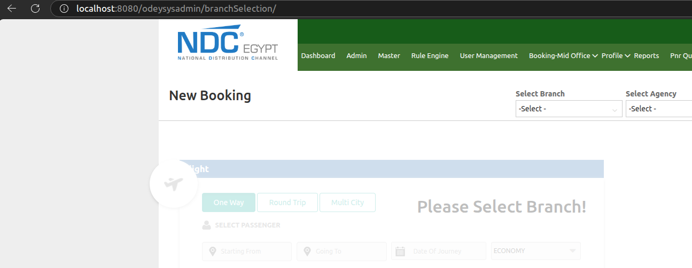
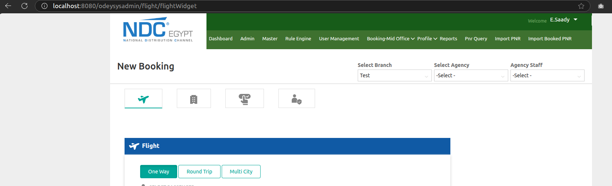
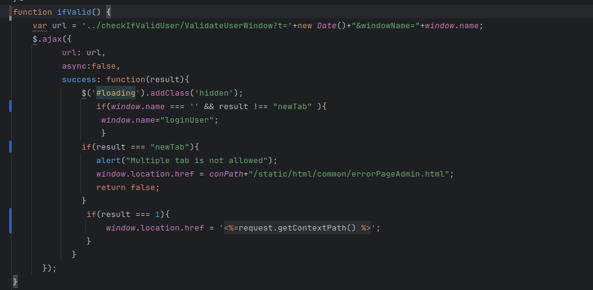
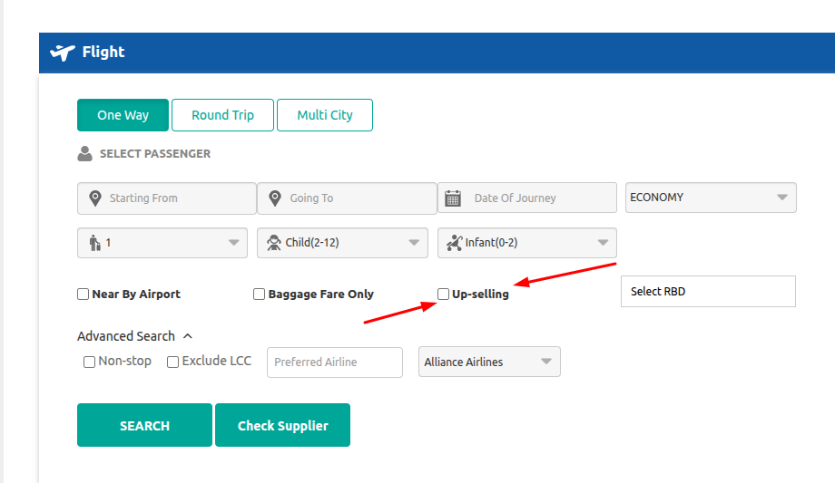
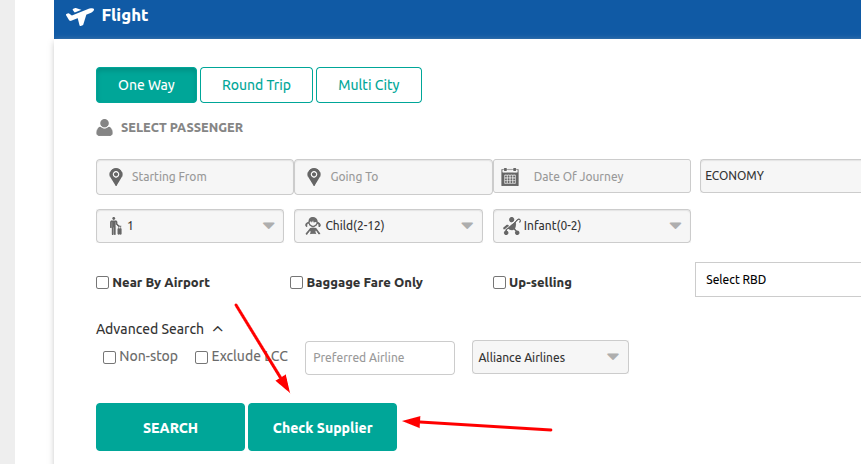

# ✈️ Booking Module Investigation – Front/Back Contract Review

Welcome aboard! This document captures the ongoing work and analysis related to the **Booking Module** of our system.  
The goal? To modernize, simplify, and document the backend/frontend contracts — with elegance and no nonsense (well, maybe a little).

---

### 🎯 Objective

Break down the legacy structure of booking-related pages and endpoints  
→ Comparing them to modern, RESTful, Angular-friendly alternatives  
→ Recommendations that make the codebase cleaner, leaner, and future-proof.

---

### 👨‍💻 Focus Area

As part of this larger task, my responsibility is the **Flight Widget Page**, which includes:
- 🛫 **One Way**
- 🔄 **Round Trip**
- 🌍 **Multi-City**

Each flow is analyzed for:
- Data structure quality
- JSON contract sanity
- Frontend rendering patterns (JSP vs Angular)
- Upgrade potential

---

Let’s dive into each page or endpoint step by step, comparing how it works now vs how it *should*.

---

## 📚 Table of Contents

1. [🏢 Endpoint: GET `/odeysysadmin/branchSelection/`](#-endpoint-get-odeysysadminbranchselection)
2. [🏢 Endpoint: POST `/odeysysadmin/branchSelection/selectBranch`](#-endpoint-post-odeysysadminbranchselectionselectbranch)
3. [✈️ Endpoint: GET `/odeysysadmin/flight/flightWidget`](#-endpoint-get-odeysysadminflightflightwidget)
4. [🧑‍💼 Endpoint: POST `/odeysysadmin/flight/selectAgency`](#-endpoint-post-odeysysadminflightselectagency)
5. [👤 Endpoint: POST `/odeysysadmin/flight/selectAgent`](#-endpoint-post-odeysysadminflightselectagent)
6. [🔁 Endpoint GET `/odeysysadmin/flight/flightWidget` (Again)](#-endpoint-get-odeysysadminflightflightwidget-again)
7. [✈️ Endpoint: GET `/odeysysadmin/flight/getAllAirports`](#-endpoint-get-odeysysadminflightgetallairports)
8. [✈️ Endpoint: GET `/odeysysadmin/flight/getPreferedAirline`](#-endpoint-get-odeysysadminflightgetpreferedairline)
9. [👤 Endpoint: POST `/odeysysadmin/pax/searchPaxByNameMob`](#-endpoint-post-odeysysadminpaxsearchpaxbynamemob)
10. [✈️ Endpoint: POST `odeysysadmin/flight/flightOneWay`](#-endpoint-post-odeysysadminflightflightoneway)
11. [🔁 Endpoint: POST `odeysysadmin/flight/flightRoundTrip`](#-endpoint-post-odeysysadminflightflightroundtrip)
12. [🌍 Endpoint: POST `/odeysysadmin/flight//flightMultiCity`](#-endpoint-post-odeysysadminflightflightmulticity)
13. [🔐 Endpoint: GET `/odeysysadmin/checkIfValidUser/ValidateUserWindow`](#-endpoint-get-odeysysadmincheckifvaliduservalidateuserwindow)
14. [📘 Endpoint: GET `/odeysysadmin/settings/Up-Selling`](#-endpoint-get-odeysysadminsettingsup-selling)
15. [📘 Endpoint: GET `/odeysysadmin/settings/CHECK-SUPPLIER-REQUEST-RESPONSE`](#-endpoint-get-odeysysadminsettingscheck-supplier-request-response)
16. [✈️ Endpoint: GET `/odeysysadmin/flight/lastFiveSearchs`](#-endpoint-get-odeysysadminflightlastfivesearchs)
17. [✈️ Endpoint: GET `/odeysysadmin/flight/getSuppliersName`](#-endpoint-get-odeysysadminflightgetsuppliersname)
18. [✈️ Endpoint: GET `/odeysysadmin/check-supplier/supplier-data`](#-endpoint-get-odeysysadmincheck-suppliersupplier-data)
19. [✈️ Endpoint: POST `/odeysysadmin/check-supplier/check-supplier-search`](#-endpoint-post-odeysysadmincheck-suppliercheck-supplier-search)

---

## 🏢 Endpoint: GET `/odeysysadmin/branchSelection/`

### 📄 Description
This is one of the legacy endpoints in the booking system. It returns a `ModelAndView/Document` object used to render a **branch selection page** in a JSP view.  
As part of the booking workflow, this page allows the user to choose a branch from a dropdown.



#### 🔄 Role in This
As part of the Flight Widget/Booking Module investigation, this page is analyzed for potential improvement.  
It currently works in a traditional Spring MVC + JSP flow, but can be enhanced to better support RESTful, frontend-driven architecture.

---

### 📥 Legacy Behavior

- **Type:** Spring `ModelAndView/Document`
- **Injected Property:** `branchList`
- **Used In:** JSP page to render a branch `<select>` dropdown
- **Format:** Full list of group/branch models with many unused fields
<details>
<summary> <h4 style="display: inline-block"> 🧾 Sample <code>branchList</code> Value:</h4> </summary>

```json
[
  {
    "availPiSearch": null,
    "companyImage": null,
    "creationTime": 1752659424364,
    "decription": null,
    "fqnName": null,
    "gapprovalStatus": null,
    "groupCode": "BRN10",
    "groupId": 964,
    "groupLevel": null,
    "groupName": "Mansoura",
    "importPnr": 1,
    "mappedagencyid": null,
    "maxRecordPerPage": 0,
    "noOfDepartment": null,
    "oldName": null,
    "operatingCountry": null,
    "orgContactModel": null,
    "orgModal": null,
    "pageNumber": 1,
    "parenGroupList": null,
    "parentGroupId": 0,
    "phoneCode": null,
    "phoneCodeOne": null,
    "siteId": 0,
    "status": null,
    "userBranchList": null,
    "userModel": null,
    "userOperatingCountryList": null
  }
]
```
</details>

### 🚀 Implementation

- Just render data in dropdown

### ✅ Recommended Approach: REST API which already implemented in system

- POST Master2/Branch/search

#### 🧾 Sample `response` Value:
```json
{
  "payload": [
    {
      "branchId": 948,
      "branchCode": "BRN2",
      "branchName": "Test",
      "countryId": 67,
      "countryName": "Egypt",
      "cityName": "Dahab",
      "approvalStatus": 1
    }
  ],
  "total": 53
}
```

---

## 🏢 Endpoint: POST `/odeysysadmin/branchSelection/selectBranch`

### 📄 Description
This endpoint is triggered when a user selects a branch in the branch selection dropdown.  
It returns some backend data, but it is **not used meaningfully** anywhere in the frontend.

### 📥 Current Behavior

- **Type:** XHR
- **Triggered By:** Selecting a branch
- **Data Returned:** A nested array called `agencyList1` and a flat `PRODUCTLIST`

#### 🔧 Sample Response:
```json
{
  "agencyList1": [
    [
      10482,
      "AGN33",
      67,
      948,
      "AGN9590",
      null
    ],
    [
      10514,
      "cai",
      67,
      948,
      "AGN9610",
      null
    ]
  ],
  "PRODUCTLIST": [1, 2, 3, 4]
}
```

### 🚀 Implementation
- N/A

### 🔍 Observation
- The backend needs to call this endpoint in ablution, and thus we can only improve the data return from it and use it instead of agencyList property founded in ModalAndView/Document
- No values from this response are used in the UI or any known logic
- The only side effect is navigating the browser to flight/flightWidget
- The actual page load is handled separately by a ModelAndView, which we'll describe shortly

### ✅ Recommended Approach
- Improving the endpoint naming
- Return consistent values
```http
GET branch/{branchId}/agencies
```
#### 🧾 Sample `response` Value:
```json
[
  {
    "id": 10696,
    "name": "samir",
    "code": "AGN9663",
    "countryName": "Egypt",
    "cityName": "aswan",
    "branchName": "samir",
    "status": 1,
    "approvalStatus": 1
  }
]
```

---

## ✈️ Endpoint: GET `/odeysysadmin/flight/flightWidget`

### 📄 Description
This is the main **entry point** of the flight booking page.  
It returns a `ModelAndView/Document` that provides required data to the JSP view, including branch and agency information, which are then rendered in dropdowns.

> 🧠 This is part of the legacy server-rendered flow. Our goal is to modernize it by replacing it with a clean REST structure.




---

### 📥 Current Behavior

- **Type:** `ModelAndView/Document`
- **View:** JSP
- **Injected Properties:**
    - `branchList`: List of branches
    - `agencyList`: List of agencies (nested arrays)

---

#### 🏢 1) `branchList` (Property)
```json
[
  {
    "availPiSearch": null,
    "companyImage": null,
    "creationTime": 1752659424364,
    "decription": null,
    "fqnName": null,
    "gapprovalStatus": null,
    "groupCode": "BRN10",
    "groupId": 964,
    "groupLevel": null,
    "groupName": "Mansoura",
    "importPnr": 1,
    "mappedagencyid": null,
    "maxRecordPerPage": 0,
    "noOfDepartment": null,
    "oldName": null,
    "operatingCountry": null,
    "orgContactModel": null,
    "orgModal": null,
    "pageNumber": 1,
    "parenGroupList": null,
    "parentGroupId": 0,
    "phoneCode": null,
    "phoneCodeOne": null,
    "siteId": 0,
    "status": null,
    "userBranchList": null,
    "userModel": null,
    "userOperatingCountryList": null
  }
]
```
#### 🏢 2) `agencyList` (Property)
```json
[
  [
    10482,
    "AGN33",
    67,
    948,
    "AGN9590",
    null
  ],
  [
    10514,
    "cai",
    67,
    948,
    "AGN9610",
    null
  ]
]
```

### 🚀 Implementation
- Just render data in dropdown lists

---
### ✅ Recommended Approach: REST API
- Ignore`branchList` property for `POST Master2/Branch/search` which already implemented in system
- Ignore `agencyList` property for `GET branch/{branchId}/agencies` recommended endpoint

---

## 🧑‍💼 Endpoint: POST `/odeysysadmin/flight/selectAgency`

### 📄 Description

This endpoint is triggered when a user selects an **Agency** in the dropdown.  
It returns a list of **agents (staff users)** under that agency, which is rendered in another dropdown and made required for booking.

---

### 📥 Current Behavior

- **Type:** XHR (POST)
- **Triggered By:** Selecting an agency
- **Response:**
  - `agentList`: A list of deeply nested user objects
  - `PRODUCTLIST`: List of numbers (unused)

#### 🧾 Sample Response:


```json
{
  "agentList": [
    {
      "userAlias": null,
      "password": null,
      "userId": 12756,
      "title": 0,
      "displayTitle": null,
      "firstName": "sayed",
      "middleName": null,
      "lastName": null,
      "mobileNo": null,
      "mobileNo1": null,
      "phoneCode1": null,
      "dob": null,
      "profileImage": null,
      "uploadProfileImage": null,
      "email": null,
      "fax": null,
      "gender": 0,
      "marritalStatus": 0,
      "userType": 0,
      "approvalId": null,
      "displayUserType": null,
      "lastLoginDate": null,
      "creationTime": null,
      "lastModifiedDate": null,
      "userStatus": 0,
      "disableSignIn": 0,
      "importPnr": null,
      "transferPnr": null,
      "userScopeType": 0,
      "lastModifiedPassTime": null,
      "selectedSite": null,
      "userAddressList": [],
      "userContacts": [],
      "userRolesList": [],
      "groupBeanList": [],
      "operatingCountryList": [],
      "assignedGroupAdminList": [],
      "userTemplate": {
        "templateId": 0,
        "siteId": 0,
        "templateName": null,
        "description": null,
        "status": 0,
        "creation_time": null,
        "created_by": null,
        "last_updated_by": null,
        "checkStatus": 0,
        "templateMenuMapping": [],
        "menuBeanList": []
      },
      "staff": {
        "id": 0,
        "staffCode": null,
        "department": null,
        "designation": null,
        "isUndercut": null,
        "isUndercutBelowNetPrice": null,
        "status": null,
        "user": null,
        "userModal": null,
        "noOfDepartment": null,
        "noOfSelectedDepartment": null,
        "company": null,
        "userRoleType": null,
        "userRoleName": null,
        "branch": null,
        "branchIds": null,
        "operatingCountry": null,
        "firstName": null,
        "groupId": null,
        "userAlias": null,
        "userEmail": null,
        "action": null,
        "changeStatus": null,
        "branchName": null,
        "roleIds": null,
        "approvalUserId": null,
        "approvalStatus": null,
        "approvalDate": null,
        "approvalRemarks": null,
        "approvalBy": null,
        "displayRights": null,
        "userType": null,
        "userTypeName": null,
        "currentSearchStatus": null,
        "pageNumber": 1,
        "maxRecordPerPage": 0,
        "userBranchList": null,
        "userOperatingCountryList": null,
        "staffDepartmentMappingList": []
      },
      "userRoleMappings": [],
      "userOrganizationId": null,
      "agencyId": 0,
      "agencyCode": null,
      "agencyName": null,
      "agentId": 0,
      "agentName": null,
      "clientIp": null,
      "browserInfo": null,
      "sessionId": null,
      "phoneCode": null,
      "staffDepartmentMappingList": [],
      "uploadImage": null,
      "staffDepartmentMappingNewList": []
    }
  ],
  "PRODUCTLIST": [
    1,
    2,
    3,
    4
  ]
}
```


## ⚠️ Observations
- The backend needs to call this endpoint in ablution, and thus we can only improve the data return from it and use it instead of agentList property founded in ModalAndView/Document
- Overloaded, verbose payload with many unused fields
- Nested structure makes it difficult to extract what’s actually needed
- PRODUCTLIST is again unused, as in previous endpoints

---

### ✅ Recommended Approach
- Improving the endpoint naming
- Return consistent values
```http
GET agencies/{agencyId}/agents
```
#### 🧾 Sample `response` Value:
```json
[{
  "staffId": 10482,
  "staffName": "Mohamed Nasr"
}]
```

---

## 👤 Endpoint: POST `/odeysysadmin/flight/selectAgent`

### 📄 Description

This endpoint is triggered when a user selects an **Agent**.  
However, it does **not** return any meaningful data — instead, it simply navigates the browser back to `/flight/flightWidget`, effectively **reloading** the page and re-fetching values already known.

---

### 📥 Current Behavior

- **Type:** XHR (POST)
- **Triggered By:** Agent selection
- **Effect:** Redirects to `/flight/flightWidget`

## ⚠️ Observations
- The backend needs to call this end point absolutely, but nothing is done in the frontend; Thus, the backend can ignore the return of any data

### ✅ Recommended Approach
- Improving the endpoint naming
- Ignore the return of any data
```http
GET agents/{agentId}
```

---

## 🔁 Endpoint GET `/odeysysadmin/flight/flightWidget` (Again)

Re-fetches previously known values and injects them into the JSP view again:

### 📥 Current Behavior
- **Type:** ModalAndView/Document (GET)


### Injected Properties:

#### 🏢 1) `branchList`:
```json
[
  {
    "availPiSearch": null,
    "companyImage": null,
    "creationTime": 1752659424364,
    "decription": null,
    "fqnName": null,
    "gapprovalStatus": null,
    "groupCode": "BRN10",
    "groupId": 964,
    "groupLevel": null,
    "groupName": "Mansoura",
    "importPnr": 1,
    "mappedagencyid": null,
    "maxRecordPerPage": 0,
    "noOfDepartment": null,
    "oldName": null,
    "operatingCountry": null,
    "orgContactModel": null,
    "orgModal": null,
    "pageNumber": 1,
    "parenGroupList": null,
    "parentGroupId": 0,
    "phoneCode": null,
    "phoneCodeOne": null,
    "siteId": 0,
    "status": null,
    "userBranchList": null,
    "userModel": null,
    "userOperatingCountryList": null
  }
]
```

#### 🏢 2) `agencyList`:
```json
[
  [
    10482,
    "AGN33",
    67,
    948,
    "AGN9590",
    null
  ],
  [
    10514,
    "cai",
    67,
    948,
    "AGN9610",
    null
  ]
]
```

#### 🏢 3) `agentList`:
```json
[
  {
    "creationTime": null,
    "password": null,
    "agentId": 0,
    "fax": null,
    "phoneCode": null,
    "importPnr": null,
    "transferPnr": null,
    "sessionId": null,
    "userId": 12777,
    "gender": 0,
    "userAlias": null,
    "title": 0,
    "agencyCode": null,
    "userType": 0,
    "agencyId": 0,
    "mobileNo": null,
    "agencyName": null,
    "uploadImage": null,
    "profileImage": null,
    "operatingCountryList": [],
    "approvalId": null,
    "firstName": "ahmed",
    "lastName": null,
    "email": null,
    "dob": null,
    "clientIp": null,
    "middleName": null,
    "agentName": null,
    "phoneCode1": null,
    "displayUserType": null,
    "browserInfo": null,
    "mobileNo1": null,
    "userOrganizationId": null,
    "disableSignIn": 0,
    "userStatus": 0,
    "lastModifiedDate": null,
    "selectedSite": null,
    "staffDepartmentMappingNewList": [],
    "uploadProfileImage": null,
    "lastLoginDate": null,
    "marritalStatus": 0,
    "displayTitle": null,
    "userScopeType": 0,
    "staffDepartmentMappingList": [],
    "lastModifiedPassTime": null
  }
]
```


### ⚠️ Observations
- This flow creates an unnecessary page reload
- All values (branchList, agencyList, agentList) are already retrieved in previous steps
- No meaningful state is changed during this POST

### 🚀 Implementation
- Just render data in dropdown lists

---
### ✅ Recommended Approach: REST API
- Ignore`branchList` property for `POST Master2/Branch/search` which already implemented in system
- Ignore `agencyList` property for `GET branch/{branchId}/agencies` recommended endpoint
- Ignore `agentList` property for `GET agencies/{agencyId}/agents` recommended endpoint

---

## ✈️ Endpoint: POST `/odeysysadmin/flight/getAllAirports`

### 📄 Description

This endpoint is used to retrieve a **list of all airports**, including metadata like airport code, name, country, and city.  
Currently, it returns a **heavy and verbose** payload with many unused or redundant fields.

---

### 📥 Current Behavior

- **Type:** XHR (POST)
- **Response:** Full airport object with 40+ fields

#### 🧾 Sample Request:
```json
{
  "searchInput": "jed"
}
```

#### 🧾 Sample Response:
```json
[
  {
    "creationTime": null,
    "status": 0,
    "longitute": null,
    "approvalDate": null,
    "action": "Create",
    "lastModTime": null,
    "createdBy": 0,
    "approvalUserId": null,
    "flightSupplierId": null,
    "userType": null,
    "maxRecordPerPage": 0,
    "pageNumber": 1,
    "airportJson": null,
    "is_international": false,
    "is_domestic": false,
    "approvalStatus": 0,
    "cityName": "Jeddah",
    "airportSuppliersList": null,
    "airportCode": "JED",
    "latitude": null,
    "nearByAirport": null,
    "countryID": 195,
    "updatedCountryName": "SA",
    "siteId": 0,
    "stationType": "1",
    "airportName": "King Abdulaziz International",
    "displayRights": null,
    "cityId": 3635,
    "airportId": 3231,
    "selectAirport": null,
    "approvalRemarks": null,
    "currentSearchStatus": null,
    "countryName": "Saudi Arabia",
    "lastUpdatedBy": 0,
    "clientIpAddress": null,
    "updatedCityName": null,
    "isSource": false,
    "airportsSubHistory": null,
    "approvalBy": null,
    "airportMapModal": null,
    "airportCheckStatus": false,
    "updatedCityId": 0,
    "updatedCountryId": 0,
    "loggedInUserOperatingCountryList": null,
    "gmt": 0.0,
    "statusName": null,
    "isDestination": false,
    "type": null
  }
]
```

### ✅ Recommended Approach
- Use REST API already implemented in system `POST Master2/airport/search`
#### 🧾 Sample `request` body value:
```json
{
  "status": 1,
  "code": "CAI",
  "name": "Cairo"
}
```

#### 🧾 Sample `response` Value:
```json
{
  "payload": [
    {
      "id": 1075,
      "name": "Cairo International Airport",
      "iataCode": "CAI"
    }
  ],
  "total": 1
}
```

- 🎯 Returns just enough information to identify the airport, link it to city/country, and display in dropdowns or selectors.


---

## ✈️ Endpoint: POST `/odeysysadmin/flight/getPreferedAirline`

### 📄 Description

This endpoint is responsible for retrieving **airline information** by name or code, often used when users select or search for a preferred airline.

---

### 📥 Current Behavior

- **Type:** XHR (POST)
- **Parameters:** airline name or code
- **Response:** Full airline object with lots of extra and unused data

#### 🧾 Sample Request:
```json
{
  "airlineType": 1,
  "airlineName": "test"
}
```

#### 🧾 Sample Response:
```json
[
  {
    "userId": null,
    "action": "",
    "approvalUserId": null,
    "approvalDate": null,
    "displayRights": null,
    "approvalBy": null,
    "approvalStatus": 1,
    "networkType": 2,
    "imagePath": null,
    "userType": null,
    "imgPath": null,
    "imagePathShowPrice": null,
    "allianceName": null,
    "codeSharingAllowed": false,
    "currentSearchStatus": null,
    "maxRecordPerPage": 0,
    "pageNumber": 1,
    "approvalRemarks": null,
    "airlineCode": "TEST",
    "airlineName": "test",
    "airlineType": 1,
    "airlinesSubHistory": null,
    "clientIpAddress": null,
    "imagePathPriceMatrix": null,
    "airlinePassport": null,
    "networkTypeName": null,
    "creationTime": null,
    "status": 1,
    "createdBy": 0,
    "lastModTime": null,
    "siteId": 0,
    "contentId": 746,
    "lastUpdatedBy": 0
  }
]
```

### ✅ Recommended Approach
- Use REST API already implemented in system `GET Master2/airline/`
- Recommend to short of response value ( id, name, code )
#### 🧾 Sample `request` query params value:
```json
{
  "status": 1,
  "airlineCode": "test",
  "airlineName": "test"
}
```

#### 🧾 Sample `response` Value:
```json
{
  "payload": [
    {
      "id": 783,
      "name": "test1",
      "code": "TES",
      "type": 0,
      "networkType": 2,
      "status": 1,
      "approvalStatus": 1,
      "userId": 1,
      "airlineHistory": [
        {
          "operationType": "Approve",
          "operationDate": "2021-10-11 08:11:47",
          "userName": "odeysysadmin",
          "clientIP": "59.152.40.227",
          "modificationValues": "STATUS=Active,APPROVAL_STATUS=Approved"
        }
      ]
    }
  ],
  "total": 2
}
```

- 🎯 Keep only the essential details needed to populate dropdowns, filters, or display basic airline info.

---


## 👤 Endpoint: POST `/odeysysadmin/pax/searchPaxByNameMob`

### 📄 Description

Used to search for a passenger using their **name**. The system attempts to locate and match existing passenger records, most likely for reuse in booking forms.

---

### 📥 Current Behavior
- **Type:** XHR (POST)
- **Parameters:** Passenger name
- **Response:** Large response object with redundant and deeply nested metadata.

#### 🧾 Sample Response:
```json
{
  "resultList2": null,
  "productName": null,
  "errorCode": null,
  "errorMessage": null,
  "resultMap": null,
  "resultLisOdeysys": null,
  "entryCount": null,
  "resultInteger2": 0,
  "posObjectId": null,
  "resultString2": null,
  "resultObject": null,
  "resultString": null,
  "resultBoolean": null,
  "policyNoList": null,
  "totalRecordsCountForSearch": null,
  "twoStepProc": null,
  "cancellationCharge": null,
  "suppCancellationStatus": null,
  "resultObject2": null,
  "productBooked": false,
  "supplierResponseFailed": false,
  "resultDouble1": null,
  "decimalCount": 0,
  "resultList": [
    {
      "oldName": null,
      "mealPreference": null,
      "status": 1,
      "phoneCode": "+20",
      "seatPreference": null,
      "depTimePreference": null,
      "specialPreference": null,
      "iqamaNumber": null,
      "iqamaExpiryDate": null,
      "nationalIdNumber": null,
      "nationalIdExpiryDate": null,
      "gender": 0,
      "createdBy": 790,
      "title": 0,
      "maxRecordPerPage": 0,
      "pageNumber": 1,
      "branchId": "BRN2",
      "agencyId": null,
      "age": 1,
      "companyId": null,
      "nationalityCode": "EG",
      "passportExpiryDate": null,
      "titleName": null,
      "firstName": "ahmed",
      "lastName": "kamel",
      "email": "akamel@wondertravel-eg.com",
      "nationalityStr": "Egypt",
      "phone": "1052454352",
      "passportNumber": "a987654342",
      "dob": 1693087200000,
      "passportIssuedCountryName": null,
      "oldEmail": null,
      "hiddenId": null,
      "city": null,
      "middleName": null,
      "branchIds": null,
      "phone1": null,
      "iqamaIssueCountry": null,
      "phoneCode1": null,
      "nationalIdIssueCountry": null,
      "journeyDate": null,
      "fromSearch": false,
      "paxIds": null,
      "paxFrequentFlyer": [],
      "paxRelationList": [],
      "passportIssueCountry": null,
      "createdDate": 1742982136000,
      "mainPaxId": null,
      "postalCode": null,
      "paxType": null,
      "province": null,
      "nationality": "67",
      "companyName": null,
      "mainPaxName": null,
      "statusUpdateProcess": false,
      "genderName": null,
      "hotelPreference": null,
      "updatedBy": null,
      "updateDate": 1742982136000,
      "companyLocation": null,
      "searchDOB": null,
      "phoneCodeFlag": null,
      "countryFlagCode": null,
      "countryFlagCode1": null,
      "iqamaIssuedCountryName": null,
      "nationalIssuedCountryName": null,
      "address": null,
      "id": 5118
    }
  ],
  "resultString3": null,
  "resultInteger": null,
  "resultDouble": null,
  "resultIntegerArray": null,
  "hotelBooked": false,
  "resultStringHotel": null,
  "resultObjecOdeysys": null,
  "cancellationStatus": null,
  "resultExplanation": null,
  "roundOffStatus": 0,
  "resultBoolean1": null
}
```


### ✅ Recommended Approach
- 🔄 Replace with `GET /odeysysadmin/passengers?search={name}`
- 🧾 Sample Response (Recommended):
```json
[
  {
    "name": "ahmed kamel",
    "id": 5118,
    "age": 1,
    "mobile": "1052454352",
    "gender": "male",
    "email": "akamel@wondertravel-eg.com",
    "nationality": "EG",
    "phoneCode": "+20",
    "dob": 1693087200000,
    "type": "adult"
  }
]
```
- 🎯 Keep only the essential details needed to populate dropdowns, filters, or display basic passenger info.

---
## ✈️ Endpoint: POST `odeysysadmin/flight/flightOneWay`

### 📄 Description

This endpoint is responsible for searching one-way flights based on the user-selected criteria on the **Flight Widget Page**.

---

### 📥 Current Behavior

- **Type:** Document/ModalAndView (POST)


### 🧾 Current Request Format (FormData)

The backend currently accepts the form as **`FormData`**, mostly structured in nested key patterns. It includes flight origin, destination, cabin class, passenger counts, and many options toggled with `on` flags.

#### 🔧 Example FormData:
```text
passengerType = passengers
flightwidgetElement[0].multiOriginList[0] = SHH
flightwidgetElement[0].multiOriginNameList[0] = Shishmaref
flightwidgetElement[0].multiOriginCityNameList[0] = Shishmaref
flightwidgetElement[0].multiOriginCountryIdList[0] = 235
flightwidgetElement[0].multiOriginList[1] = DXB
flightwidgetElement[0].multiOriginNameList[1] = Dubai International Airport
flightwidgetElement[0].multiOriginCityNameList[1] = Dubai
flightwidgetElement[0].multiOriginCountryIdList[1] = 2
flightwidgetElement[0].covercountry = SA
flightwidgetElement[0].residency = AE
flightwidgetElement[0].age = 45
tripType = OneWay
flightwidgetElement[0].startingFrom = CAI
flightwidgetElement[0].startingFromName = Cairo International Airport
flightwidgetElement[0].startingFromCity = Cairo
flightwidgetElement[0].originCountryId = 67
agencyId = 0
flightwidgetElement[0].goingTo = JED
flightwidgetElement[0].goingToName = King Abdulaziz International
flightwidgetElement[0].destCountryId = 195
flightwidgetElement[0].goingToCity = Jeddah
flightwidgetElement[0].destinationCityId = 3635
flightwidgetElement[0].dateOfJourney = 31-07-2025
flightwidgetElement[0].cabinClass = 2
flightwidgetElement[0].rbd = B,C,D,
noOfAdults = 3
noOfChilds = 3
noOfInfants = 3
nearByAirport = true
baggageFareOnly = true
returnAllFaresResultFromGal = true
RBDONEWAY = B
RBDONEWAY = C
RBDONEWAY = D
isNonStop = true
isExcludeLcc = true
prefferedAirline = VW
prefferedAirlineName = Transportes Aeromar
```


## ✅ Recommendation
- 🔄 Replace with: `POST odeysysadmin/flight/flight-one-way`
- ###### 🧾 Sample of the request for flights (Long-time Recommended):
```ts
export enum CabinClass {
  ECONOMY = 1,
  PREMIUM_ECONOMY,
  BUSINESS,
  FIRST_CLASS,
}

export enum TripType {
  OneWay = 1,
  RoundTrip,
  MultiCity,
}

export interface LegsModal {
  origins: string[] // In Multicity It will be one element in the list
  destination: string
  
  coverCountry?: string // One way and Round trip
  residency?: string // One way and Round trip
  depCountry?: string // Round trip
  
  dateOfJourney?: Date //Oneway and Multicity
  cabinClass?: number, // Multicity
  rbd?: number[] // enums Multicity
  
  onwardDateOfJourney?: Date // Round trip
  onwardCabinClass?: number, // Round trip
  onwardRbd?: number[], // enums Round trip
  
  returnDateOfJourney?: Date  // Round trip
  returnCabinClass?: number, // Round trip
  returnRbd?: number[] // enums Round trip
}

export interface FlightSearchRequestModal {
  tripType: TripType.RoundTrip,
  passengers: {
    adults: number,
    children: number,
    infants: number
  },

  baggageFareOnly: boolean,
  returnAllFaresResultFromGal: boolean
  passengerIdList: number[],

  nearByAirport?: boolean,  // Oneway and round trip
  isNonStop?: boolean, // Oneway and round trip
  isExcludeLcc?: boolean, // Oneway and round trip

  cabinClass?: CabinClass.ECONOMY, // enum   OneWay
  rbd?: number[], // enums      OneWay

  allianceName?: string, //Oneway and round trip
  preferredAirline?: string, //Oneway and round trip
  
  legs: LegsModal[]
}
```

```json

{
  "tripType": 1,
  "passengers": {
    "adults": 2,
    "children": 3,
    "infants": 1
  },

  "baggageFareOnly": true,
  "returnAllFaresResultFromGal": false,
  "passengerIdList": [1213, 2525, 2422],

  "nearByAirport": true,
  "isNonStop": true, 
  "isExcludeLcc": false, 

  "cabinClass": 3,
  "rbd": [1 ,4, 6],

  "allianceName": "test", 
  "preferredAirline": "AUG",
  
  "legs": [
    {
        "origins": ["CAI", "DXB"],
        "destination": "JDE",
  
        "coverCountry": "AE",
        "residency": "SA",
        "depCountry": "HT",
  
        "dateOfJourney": "31-07-2025",
        "cabinClass": 5,
        "rbd": [1, 6, 6] ,

        "onwardDateOfJourney": "31-07-2025" ,
        "onwardCabinClass": 5, 
        "onwardRbd": [1, 2, 3, 4] , 
  
        "returnDateOfJourney": "31-07-2025",
        "returnCabinClass": 3,
        "returnRbd": [1, 2, 3, 4] 
    }
  ]
}
```

```json
{
  "$schema": "http://json-schema.org/draft-07/schema#",
  "title": "Generated schema for Root",
  "type": "object",
  "properties": {
    "tripType": {
      "type": "number"
    },
    "passengers": {
      "type": "object",
      "properties": {
        "adults": {
          "type": "number"
        },
        "children": {
          "type": "number"
        },
        "infants": {
          "type": "number"
        }
      },
      "required": [
        "adults",
        "children",
        "infants"
      ]
    },
    "baggageFareOnly": {
      "type": "boolean"
    },
    "returnAllFaresResultFromGal": {
      "type": "boolean"
    },
    "passengerIdList": {
      "type": "array",
      "items": {
        "type": "number"
      }
    },
    "nearByAirport": {
      "type": "boolean"
    },
    "isNonStop": {
      "type": "boolean"
    },
    "isExcludeLcc": {
      "type": "boolean"
    },
    "cabinClass": {
      "type": "number"
    },
    "rbd": {
      "type": "array",
      "items": {
        "type": "number"
      }
    },
    "allianceName": {
      "type": "string"
    },
    "preferredAirline": {
      "type": "string"
    },
    "legs": {
      "type": "array",
      "items": {
        "type": "object",
        "properties": {
          "origins": {
            "type": "array",
            "items": {
              "type": "string"
            }
          },
          "destination": {
            "type": "string"
          },
          "coverCountry": {
            "type": "string"
          },
          "residency": {
            "type": "string"
          },
          "depCountry": {
            "type": "string"
          },
          "dateOfJourney": {
            "type": "string"
          },
          "cabinClass": {
            "type": "number"
          },
          "rbd": {
            "type": "array",
            "items": {
              "type": "number"
            }
          },
          "onwardDateOfJourney": {
            "type": "string"
          },
          "onwardCabinClass": {
            "type": "number"
          },
          "onwardRbd": {
            "type": "array",
            "items": {
              "type": "number"
            }
          },
          "returnDateOfJourney": {
            "type": "string"
          },
          "returnCabinClass": {
            "type": "number"
          },
          "returnRbd": {
            "type": "array",
            "items": {
              "type": "number"
            }
          }
        },
        "required": [
          "origins",
          "destination",
          "coverCountry",
          "residency",
          "depCountry",
          "dateOfJourney",
          "cabinClass",
          "rbd",
          "onwardDateOfJourney",
          "onwardCabinClass",
          "onwardRbd",
          "returnDateOfJourney",
          "returnCabinClass",
          "returnRbd"
        ]
      }
    }
  },
  "required": [
    "tripType",
    "passengers",
    "baggageFareOnly",
    "returnAllFaresResultFromGal",
    "passengerIdList",
    "nearByAirport",
    "isNonStop",
    "isExcludeLcc",
    "cabinClass",
    "rbd",
    "allianceName",
    "preferredAirline",
    "legs"
  ]
}
```
- 🎯 Keep only the essential details needed to populate dropdowns, filters, or display basic info.
---

### 🧾 Current Response [Link to Response Section]()

---


## 🔁 Endpoint: POST `odeysysadmin/flight/flightRoundTrip`

### 📄 Description

This endpoint also handles **RoundTrip** bookings. The request body is sent as `FormData`, consisting of multiple scattered fields and indexed lists.

---

### 📥 Current Behavior

- **Type:** Document/ModalAndView (POST)

### 🧾 Current Request Format (FormData)

This is how the frontend currently sends a **RoundTrip** request:

```text
passengerType = passengers
passengerIdList[0] = 7631-null-Egypt

flightwidgetElement[0].multiOriginList[0] = SHH
flightwidgetElement[0].multiOriginNameList[0] = Shishmaref
flightwidgetElement[0].multiOriginCityNameList[0] = Shishmaref
flightwidgetElement[0].multiOriginCountryIdList[0] = 235
flightwidgetElement[0].multiOriginList[1] = DXB
flightwidgetElement[0].multiOriginNameList[1] = Dubai International Airport
flightwidgetElement[0].multiOriginCityNameList[1] = Dubai
flightwidgetElement[0].multiOriginCountryIdList[1] = 2

flightwidgetElement[0].covercountry = IN
flightwidgetElement[0].residency = AE
flightwidgetElement[0].age = 45
flightwidgetElement[0].depCountry = AE

tripType = RoundTrip
flightwidgetElement[0].startingFrom = CAI
flightwidgetElement[0].startingFromName = Cairo International Airport
flightwidgetElement[0].startingFromCity = Cairo
flightwidgetElement[0].originCountryId = 67

flightwidgetElement[0].goingTo = JED
flightwidgetElement[0].goingToName = King Abdulaziz International
flightwidgetElement[0].goingToCity = Jeddah
flightwidgetElement[0].destCountryId = 195
flightwidgetElement[0].destinationCityId = 3635

flightwidgetElement[0].dateOfJourney = 22-07-2025
flightwidgetElement[0].returnDateOfJourney = 31-07-2025

flightwidgetElement[0].cabinClass = 3
flightwidgetElement[0].rbd = A
flightwidgetElement[0].rbd = E
flightwidgetElement[0].rbd = 

flightwidgetElement[1].cabinClass = 4
flightwidgetElement[1].rbd = I
flightwidgetElement[1].rbd = J
flightwidgetElement[1].rbd = K
flightwidgetElement[1].rbd = M

agencyId = 0
noOfAdults = 1
noOfChilds = 2
noOfInfants = 5

nearByAirport = true
baggageFareOnly = true
returnAllFaresResultFromGal = true
isNonStop = true
isExcludeLcc = true
allianceName = *O
```

## ✅ Recommended Request Format (JSON API)
- 🔁 Replace with: `POST odeysysadmin/flight/flight-round-trip`
- #### [ 🧾 Sample of the `request` for flights (Long-time Recommended):](#-Sample-of-the-request-for-flights-Long-time-Recommended)

---


### 🧾 Current Response [Link to Response Section]()

--- 


## 🌍 Endpoint: POST `/odeysysadmin/flight//flightMultiCity`

### 📄 Description

This endpoint is responsible for processing **Multi-City flight bookings**.  
It currently accepts a `FormData` object containing all segments under indexed `flightwidgetElement[n]` fields, then returns a `ModalAndView/Document` to render the results.

---


### 📥 Current Behavior

- **Type:** Document/ModalAndView (POST)


### 📥 Current Request Format (FormData)

```text
tripType              MultiCity
passengerType             passengers
passengerIdList[0]              7631-null-Egypt
flightwidgetElement[0].startingFrom             CAI
flightwidgetElement[0].startingFromName             Cairo International Airport
flightwidgetElement[0].startingFromCity             Cairo
flightwidgetElement[0].originCountryId              67
flightwidgetElement[0].goingToName              King Abdulaziz International
flightwidgetElement[0].goingTo              JED
flightwidgetElement[0].destCountryId              195
flightwidgetElement[0].goingToCity              Jeddah
flightwidgetElement[0].destinationCityId              3635
flightwidgetElement[0].dateOfJourney              22-07-2025
flightwidgetElement[0].cabinClass             3
flightwidgetElement[0].rbd              B
flightwidgetElement[0].rbd              D
flightwidgetElement[0].rbd              F
flightwidgetElement[1].startingFrom             JED
flightwidgetElement[1].startingFromName             King Abdulaziz International
flightwidgetElement[1].startingFromCity             Jeddah
flightwidgetElement[1].originCountryId              195
flightwidgetElement[1].goingToName              Dubai International Airport
flightwidgetElement[1].goingTo              DXB
flightwidgetElement[1].destCountryId              2
flightwidgetElement[1].goingToCity              Dubai
flightwidgetElement[1].destinationCityId              0
flightwidgetElement[1].dateOfJourney              31-07-2025
flightwidgetElement[1].cabinClass             4
flightwidgetElement[1].rbd              U
flightwidgetElement[2].startingFrom             DXB
flightwidgetElement[2].startingFromName             Dubai International Airport
flightwidgetElement[2].startingFromCity             Dubai
flightwidgetElement[2].originCountryId              2
flightwidgetElement[2].goingToName              Abu Dhabi International
flightwidgetElement[2].goingTo              AUH
flightwidgetElement[2].destCountryId              2
flightwidgetElement[2].goingToCity              Abu Dhabi
flightwidgetElement[2].destinationCityId              0
flightwidgetElement[2].dateOfJourney              30-11-2025
flightwidgetElement[2].cabinClass             2
flightwidgetElement[2].rbd              R
flightwidgetElement[2].rbd              S
flightwidgetElement[2].rbd              T
flightwidgetElement[3].startingFrom             AUH
flightwidgetElement[3].startingFromName             Abu Dhabi International
flightwidgetElement[3].startingFromCity             Abu Dhabi
flightwidgetElement[3].originCountryId              2
flightwidgetElement[3].goingToName              Kigalin International
flightwidgetElement[3].goingTo              KGL
flightwidgetElement[3].destCountryId              194
flightwidgetElement[3].goingToCity              Kigali
flightwidgetElement[3].destinationCityId              0
flightwidgetElement[3].dateOfJourney              23-06-2026
flightwidgetElement[3].cabinClass             4
flightwidgetElement[3].rbd              D
flightwidgetElement[3].rbd              E
flightwidgetElement[3].rbd              F
flightwidgetElement[3].rbd              H
noOfAdults              2
noOfChilds              4
noOfInfants             1
baggageFareOnly             true
_baggageFareOnly              on
returnAllFaresResultFromGal             true
_returnAllFaresResultFromGal              on
flightwidgetElement[0].rbd                F
```

## ✅ Recommended Request Format (JSON API)
- 🔁 Replace with: `POST odeysysadmin/flight/flight-multicity`
- #### [ 🧾 Sample of the `request` for flights (Long-time Recommended):](#-Sample-of-the-request-for-flights-Long-time-Recommended)

--- 


### 🧾 Current Response [Link to Response Section]()


---

## 🔐 Endpoint: GET `/odeysysadmin/checkIfValidUser/ValidateUserWindow`

#### 📄 Description
This endpoint is used to validate the user's session and detect if the application is opened in multiple browser tabs. It helps ensure single-tab usage and redirect users when their session is no longer valid.

#### 🛠️ Parameters
- `t`: The current timestamp. Typically generated on the client side.
- `windowName`: The name of the current browser window.

#### 🧠 Current Behavior
- **Type:** XHR (GET)
- If `windowName` is empty and the server detects an already open session, it assigns `"loginUser"` to the current window.
- If the server returns `"newTab"`, the application alerts the user and redirects them to an error page — this is used to prevent multiple tabs.
- If the server returns `1`, it means the session is invalid, and the user should be redirected to the login page.

#### ✅ Recommendation
- Replace this endpoint with a cleaner version such as:
  - `/check-validate-user/validate-user?t={ISODateTime}`
- The backend should accept standard ISO 8601 date strings (e.g., `2025-07-27T11:54:27Z`) for better compatibility and parsing.
- The response should return structured data with enum-based statuses instead of raw strings or numbers. For example:
  - `VALID`
  - `INVALID_SESSION`
  - `MULTI_TAB_NOT_ALLOWED`
```ts
export enum UserValidateStatus  {
    VALID,
    INVALID_SESSION,
    MULTI_TAB_NOT_ALLOWED
}
```

#### 💡 Notes
- Modern applications (like Angular 2+ frontends) should handle such checks using interceptors or centralized session services.
- Using blocking synchronous validation methods should be avoided for performance and UX reasons.

### 🚀 Implementation


---

## 📘 Endpoint: GET `/odeysysadmin/settings/Up-Selling`

#### 📄 Description
Fetches the current system configuration status for the **Up-Selling** feature. This configuration helps determine whether the Up-Selling option should be enabled or disabled in the application.


#### 📥 Request
- **Type:** XHR (GET)
- **URL**: `/odeysysadmin/settings/Up-Selling`

#### 📤 Response (example)
```json
{
  "statusCode": 200,
  "message": "Request Accepted",
  "actionKey": "Up-Selling",
  "actionValue": "1"
}
```


## 📘 Endpoint: GET `/odeysysadmin/settings/CHECK-SUPPLIER-REQUEST-RESPONSE`

#### 📄 Description
Returns a configuration flag that indicates whether the system should log or validate **Supplier Request and Response** data for debugging or monitoring purposes and if we will show "Check Supplier" button or not


#### 📥 Request
- **Type:** XHR (GET)
- **URL**: `/odeysysadmin/settings/CHECK-SUPPLIER-REQUEST-RESPONSE`

#### 📤 Response (example)
```json
{
  "statusCode": 200,
  "message": "Request Accepted",
  "actionKey": "CHECK-SUPPLIER-REQUEST-RESPONSE",
  "actionValue": "0"
}
```

---

## ✈️ Endpoint: GET `/odeysysadmin/flight/lastFiveSearchs`

#### 📄 Description
This endpoint is intended to return the **last five flight search records** for the current user/session. However, in the current implementation, it usually returns an empty or default response.

#### 📥 Request
- **Type:** XHR (GET)
- **URL**: `/odeysysadmin/flight/lastFiveSearchs`

#### 📤 Response (example)
```json
{
  "timeZone": null,
  "resultString": null,
  "resultList": [],
  "resultObject": null,
  "resultMap": null,
  "resultList2": null,
  "resultInteger": 0,
  "resultString4": null,
  "errorCode": null,
  "resultInteger2": 0,
  "resultBoolean": null,
  "resultString2": null,
  "resultObject2": null,
  "resultDouble1": null,
  "resultExplanation": null,
  "productBooked": false,
  "supplierResponseFailed": false,
  "decimalCount": 0,
  "policyNoList": null,
  "resultString3": null,
  "errorMessage": null,
  "resultObjecOdeysys": null,
  "resultDouble": null,
  "resultIntegerArray": null,
  "hotelBooked": false,
  "resultStringHotel": null,
  "resultLisOdeysys": null,
  "roundOffStatus": 0,
  "error": false
}
```

- ✅ Recommended replace response object with just list of data (resultList)
- 🧼 Ignore this end point if it is not already used in the system

---

## ✈️ Endpoint: GET `/odeysysadmin/flight/getSuppliersName`

#### 📄 Description
This endpoint is currently used in the flightWidgetManual page only and includes test/dummy/invalid data.


#### 📥 Request
- **Type:** XHR (GET)
- **URL**: `/flight/getSuppliersName`

#### 📤 Response (example)
```json
{
  "statusCode": 200,
  "message": "Request Accepted",
  "suppliersNameList": [
    "!@#$#%$",
    "#@$@%^#$",
    "222",
    "AirArabiaEgypt",
    "AirArbia",
    "AirArbiaUAE",
    "AirCairo",
    "Amadeus",
    "Badr",
    "DEMO",
    "FlyDubai",
    "FlyEgypt",
    "Galileo",
    "JazeeraAirways",
    "JazeeraAirwaysUAE",
    "LCC",
    "Reissue",
    "Sabre",
    "SalamAir",
    "ShuraTech",
    "sssssss",
    "Tarco",
    "TEST",
    "TravelFusion",
    "UIHUE"
  ]
}
```

--- 
## ✈️ Endpoint: GET `/odeysysadmin/check-supplier/supplier-data`

## Description
Returns a mapping of supplier names to their respective credential details (only the active suppliers on the branch specified in the research).

---

## Request
- **Type:** XHR (GET)
- **Query Parameters:** None

---

## Response

The response is a JSON object where:
- Each key is a supplier name.
- Each value is a list of credential objects for that supplier.

```json
{
  "AirArabiaEgypt": [
    {
      "supplierName": "AirArabiaEgypt",
      "credId": 281,
      "credName": "AirArabiaEgypt",
      "pccType": null
    }
  ],
  "Galileo": [
    {
      "supplierName": "Galileo",
      "credId": 271,
      "credName": "Galileo live",
      "pccType": null
    }
  ]
}
```

### ✅ Recommended Approach: Enhancing

- Enhance response value

#### 🧾 Sample `response` Value:
```json
[
  {
    "id": 171,
    "name": "TravelportNdc",
    "supplierCredential": [
      {
        "id": 329,
        "name": "staging"
      },
      {
        "id": 330,
        "name": "StagingEGY"
      }
    ]
  }
]
```

---

## ✈️ Endpoint: POST `/odeysysadmin/check-supplier/check-supplier-search`

## Description
Checks supplier request/response status based on search input and credential.  
**Only `supplierRequest` and `supplierResponse` fields in the response are useful.**

---

## Request
- **Type:** XHR (POST)
- Request Body

```json
{
  "flightWidget": {
    "corporateIdList": [],
    "dataFromCacheOrNot": true,
    "tripType": "OneWay",
    "upgradeBooking": 0,
    "fareMismatch": 0,
    "prefferedAirlineName": null,
    "passengerType": "",
    "hotelRequestBean": null,
    "selectedHotel": null,
    "isExcludeLcc": false,
    "orderId": null,
    "nearByAirport": false,
    "seeMore": false,
    "allianceName": "",
    "isDateFlexible": false,
    "isNonStop": false,
    "hotelCrossSell": false,
    "baggageFareOnly": false,
    "multiAvailability": false,
    "noOfAdults": "1",
    "noOfChilds": "",
    "noOfInfants": "",
    "searchId": 0,
    "prefferedAirline": null,
    "passengerIdList": [],
    "lastFiveSearch": false,
    "returnAllFaresResultFromGal": false,
    "flightwidgetElement": [
      {
        "destinationCityId": "3635",
        "age": [45],
        "multiOriginNameList": null,
        "multiOriginCityNameList": null,
        "multiOriginCountryIdList": null,
        "preferredAirline": "",
        "residency": "AE",
        "residencyId": null,
        "startingFrom": "CAI",
        "goingTo": "JED",
        "depCountry": null,
        "rbd": "",
        "goingToCity": "Jeddah",
        "cabinClass": "1",
        "dateOfJourney": "28-08-2025",
        "returnDateOfJourney": null,
        "multiOriginList": null,
        "destCountryId": "195",
        "originCountryId": 67,
        "goingToName": "King Abdulaziz International",
        "covercountry": "SA",
        "sourceCityId": 0,
        "recheck": 0,
        "startingFromCity": "Cairo",
        "startingFromName": "Cairo International Airport"
      }
    ],
    "flexibleDateForCaching": false,
    "bookingViaSearch": null
  },
  "supplierCredDto": {
    "supplierName": "AmdNDC",
    "credId": 333,
    "credName": "Amadeus NDC",
    "pccType": "SEARCH"
  }
}

```

## Response

- **Content-Type:** `application/json`

### Response Body

```json
{
  "supplierRequest": "<RAW XML or JSON request to supplier>",
  "supplierResponse": "<RAW XML or JSON response from supplier>",
  "...": "// many other fields to be ignored"
}
```
Show huge [Response](./huge-response/check-supplier-result.json)

#### 📝 Notes
- This endpoint is used mainly for debugging supplier integration.
- Use only the supplierRequest and supplierResponse to validate supplier communication.
- Rest of the response data is verbose and non-critical for most use cases.


### ✅ Recommended Approach:
- Ignore all unused filed in response object
- Return just supplier status
```json
{
  "status": 1
}
```


